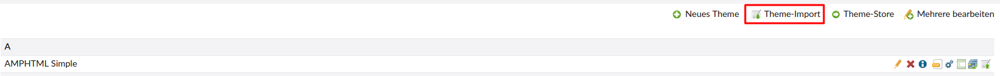
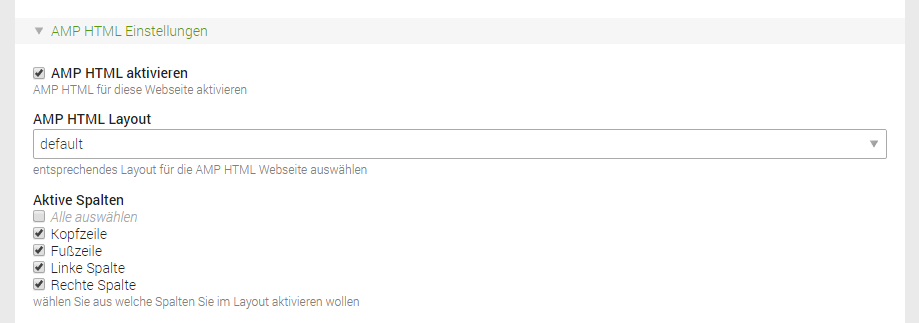

# Einrichtung

1. 
Herunterladen der cto-Datei von https://github.com/pdir/amphtml-bundle/raw/master/files/amphtml.cto 
2. 
Das Theme über **"Themes > Theme Import"** installieren.

3. 
AMPHTML im Startpunkt der Webseite aktivieren, **default** als AMP HTML Layout auswählen und die gewünschten Spalten, die angezeigt werden sollen, auswählen

Mit dem Zusatz **?amp**, der an die Domain angehangen wird, lassen sich die Amp-Seiten aufrufen (z. B. www.domain.de?amp).

## CSS-Anpassungen

Individuelle CSS-Anpassungen der AMPHTML-Seite erfolgen über eine **amphtml_custom.css**.

1. 
Umbenennen der Datei **amphtml\_custom\_.css** in **amphtml\_custom.css** unter **files/amphtml**
2. 
Kopieren des CSS von **amphtml.css** in **amphtml_custom.css**
3. 
Änderungen in der amphtml_custom.css vornehmen