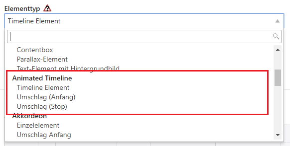
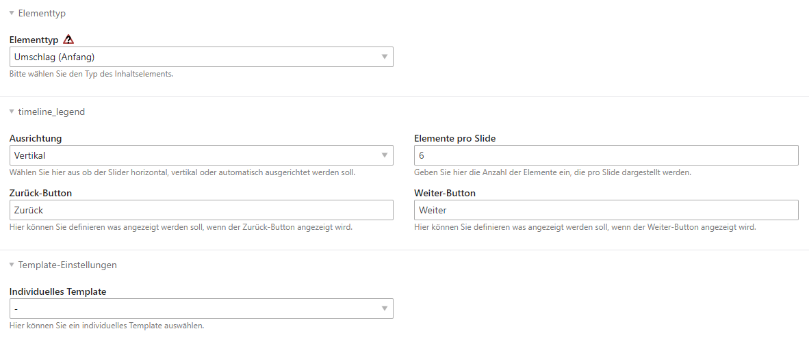
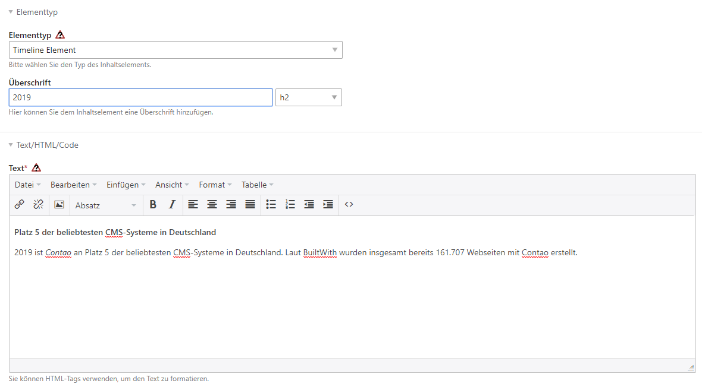
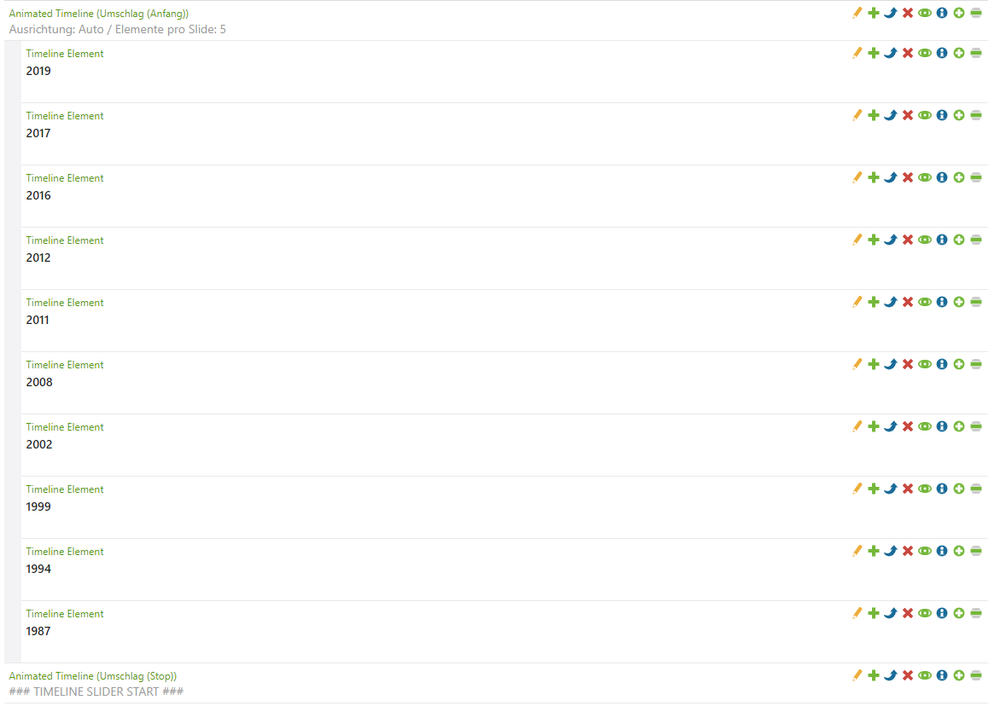

# Einrichtung

## Platzieren der Content Elemente

### Umschlagselemente

Platzieren Sie in einem Artikel zunächst ein Element vom Typ **Umschlag (Anfang)** und **Umschlag (Ende)** - zu finden unter Animated Timeline (siehe folgender Screenshot).

Beim Elementtyp **Umschlag (Anfang)** haben Sie folgende Einstellmöglichkeiten:
* **Ausrichtung**: 
  * Horizontal: Der Slider wird horizontal dargestellt, aber nicht mobil optimiert.
  * Vertikal: Der Slider wird vertikal dargestellt und für mobile Geräte auch entsprechend optimiert.
  * Auto: Der Slider wird auf Desktop-Geräten horizontal und auf mobilen Geräten vertikal dargestellt.
* **Elemente pro Slide**: Anzahl der Elemente, die pro Seite dargestellt werden. Wenn mehr Elemente als angegeben vorhanden sind wird eine Navigation zum Einblenden der weiteren Elemente angezeigt.
* **Zurück-Button**: Hier können Sie den Zurück-Button definieren, wenn es mehr Elemente gibt als pro Slide angegeben. Sie können auch HTML einfügen und z. B. ein Icon einer Font-Icon-Bibliothek einbinden.
* **Weiter-Button**: Hier können Sie den Weiter-Button definieren, wenn es mehr Elemente gibt als pro Slide angegeben. Sie können auch HTML einfügen und z. B. ein Icon einer Font-Icon-Bibliothek einbinden.
* **Individuelles Template**: Wenn Sie das Template kopieren und anpassen wollen, können Sie dies hier auswählen.

### Timeline Element

Innerhalb der Umschlagselemente platzieren Sie ein Element vom Typ **Timeline Element**. Dort können Sie eine Überschrift sowie einen Text eintragen.

So könnte es im Backend aussehen:

## Beispiele

### Horizontale Ausrichtung / Auto

### Vertikale Ausrichtung

