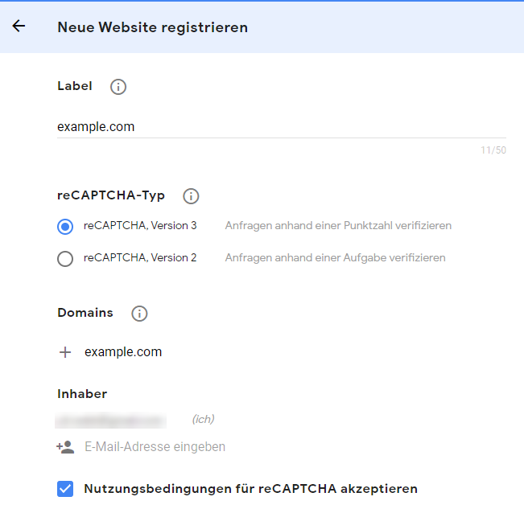
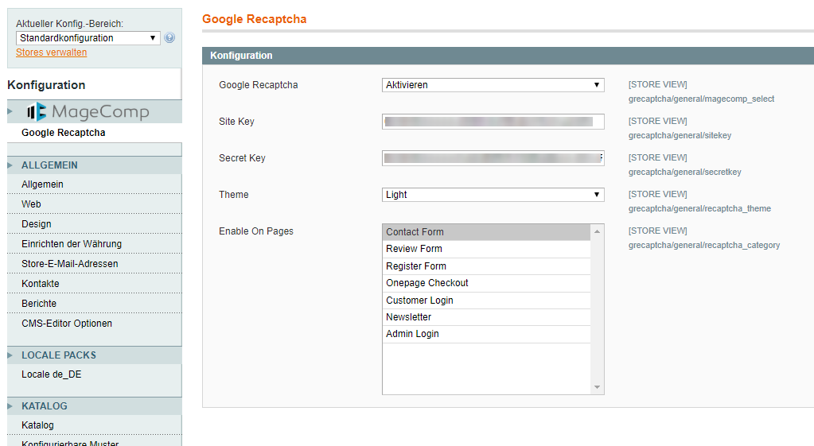

# Google reCAPTCHA konfigurieren

Rufen Sie folgende Webseite auf: [https://www.google.com/recaptcha/intro/v3.html](https://www.google.com/recaptcha/intro/v3.html) und klicken Sie in der Navigation oben rechts auf den Button **Admin console**. Dort melden Sie sich mit Ihrem Google-Konto an oder legen es an, wenn es noch nicht vorhanden ist. Anschließend erscheint eine Eingabemaske, wo Sie eine neue Webseite registrieren können.

* **Label**: Geben Sie eine beliebige Bezeichnung ein, z. B. den Namen Ihrer Webseite.
* **reCAPTCHA-Typ**: Wählen Sie die entsprechende Version aus. Wir empfehlen die neueste Version.
* **Domains**: Fügen Sie die Domains hinzu, auf denen Sie das reCAPTCHA nutzen wollen.
* Akzeptieren Sie die Nutzungsbedingungen.

Wenn Sie auf Senden klicken, sollte nun die Meldung erscheinen, dass die Webseite registriert wurde. Außerdem sehen Sie den **Webseitenschlüssel** und den **geheimen Schlüssel**, den Sie für die anschließende Konfiguration benötigen.

## Magento

Für Magento 1.x können Sie die kostenlose Erweiterung [Magento Google ReCAPTCHA](https://magecomp.com/magento-google-recaptcha.html) installieren. Die Erweiterung ist auch für Magento 2.x verfügbar, allerdings nicht kostenfrei.

Die Erweiterung können Sie über **System** > **Konfiguration** > **Google Recaptcha** aktivieren und konfigurieren.

* **Site Key**: Tragen Sie hier den Webseitenschlüssel ein.
* **Secret Key**: Tragen Sie hier den geheimen Schlüssel ein.
* **Enable On Pages**: Wählen Sie hier alle Formulare aus auf denen reCAPTCHA genutzt werden soll.

