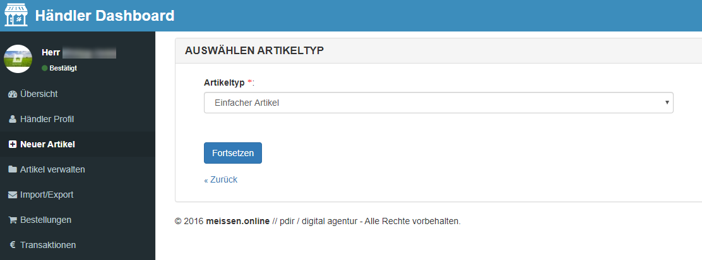
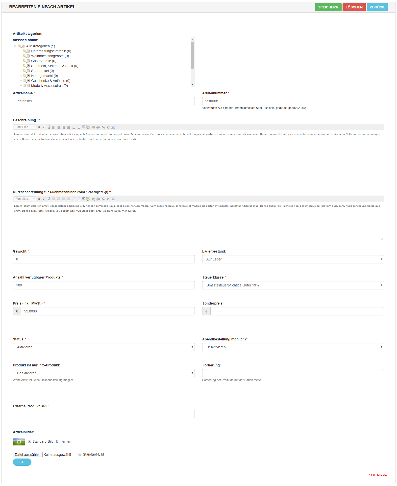
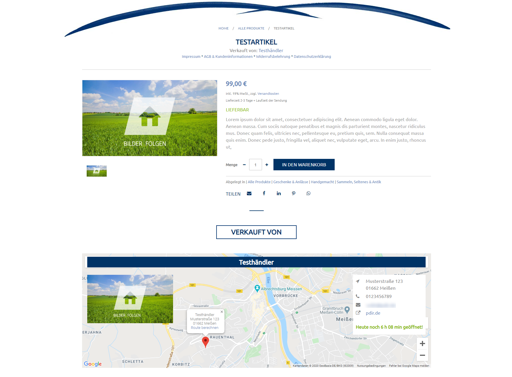
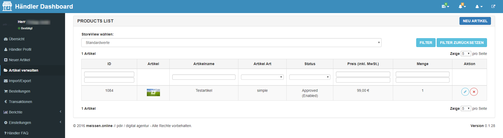

# Artikel verwalten

- [Artikel anlegen](kundendoku/meissen.online/artikel-verwalten.md?id=artikel-anlegen)
- [Artikel verwalten](kundendoku/meissen.online/artikel-verwalten.md?id=artikel-verwalten)

## Artikel anlegen

Um einen neuen Artikel anzulegen, klicken Sie in der linken Navigationsleiste auf **Neuer Artikel** und wählen den 
Artikeltyp **Einfacher Artikel** aus.

Anschließend erscheint die Eingabemaske für das Anlegen des Artikels. Hinweis: Den Speichern-Button finden Sie oben 
rechts.

* **Artikelkategorien:** Bitte wählen Sie die entsprechenden Kategorien aus.
* **Artikelname:** Bitte vergeben Sie einen Namen für den Artikel.
* **Artikelnummer:** Bitte vergeben Sie Ihr Firmenkürzel als Suffix: z. B. gha0001, gha0002 usw.
* **Beschreibung:** Beschreiben Sie Ihren Artikel.
* **Kurzbeschreibung für Suchmaschinen:** Vergeben Sie hier eine Beschreibung, die nur zur besseren Auffindbarkeit für 
Suchmaschinen wie Google dient (maximal 320 Zeichen).
* **Gewicht:** Das Gewicht wird derzeit noch nicht auf der Webseite angezeigt, daher können Sie hier auch 0 eintragen.
* **Lagerbestand:** Wählen Sie Auf Lager aus, wenn der Artikel aktuell bestellt werden kann.
* **Anzahl verfügbarer Produkt:** Geben Sie hier die Anzahl der aktuell verfügbaren Artikel an, bei jeder Bestellung wird 
die Lagermenge aktualisiert.
* **Steuerklasse:** Wählen Sie die entsprechende Steuerklasse aus.
* **Preis (inkl. MwSt.):** Geben Sie den Artikelpreis an (mit Komma oder Punkt getrennt und ohne Währungszeichen). 
Wenn Sie 0.001 in das Feld eintragen, erscheint als Ausgabe "Auf Anfrage".
* **Sonderpreis:** Wenn Sie dieses Feld ausfüllen, wird dieser Preis, statt dem regulären Preis, angezeigt.
* **Status:** Wählen Sie Aktivieren aus, wenn der Artikel auf der Webseite angezeigt werden soll.
* **Abendbestellung möglich:** Eine Abendbestellung ist derzeit noch nicht möglich, daher können Sie dieses Feld ignorieren.
* **Produkt ist nur Info-Produkt:** Deaktivieren Sie diese Option, wenn der Artikel bestellt werden kann. Ansonsten erscheint 
nur ein Button zum Kontaktieren des Händlers.
* **Sortierung:** Hier können Sie eine Zahl zur Sortierung Ihrer Produkte eintragen. Die Produkte werden dann aufsteigend 
danach sortiert.
* **Externe Produkt URL:** Tragen Sie hier die URL ein, wenn das Produkt in einem anderen Shop vertrieben wird und man es 
nicht auf meissen.online bestellen sollen können.
* **Artikelbilder:** Fügen Sie neue Bilder hinzu, indem Sie auf Datei auswählen klicken. Ein Bild muss immer als 
Standard-Bild definiert werden. Weitere Bilder können Sie dann über den blauen Plus-Button hinzufügen.

So könnte der Artikel bei meissen.online am Ende aussehen:

## Artikel verwalten

Um Ihre Artikel zu verwalten, klicken Sie in der linken Navigationsleiste auf **Artikel verwalten**.

