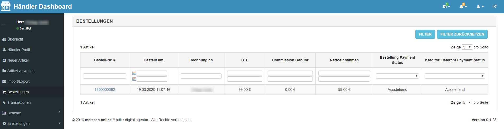

# Bestellungen verwalten

Ihre eingegangenen Bestellungen können Sie im Händler-Dashboard einsehen, indem Sie in der linken Navigationsleiste 
auf **Bestellungen** klicken. Zusätzlich bekommen Sie für jede Bestellung noch eine E-Mail zugesandt.

