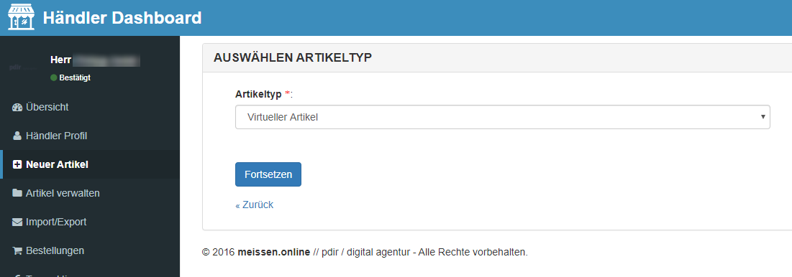
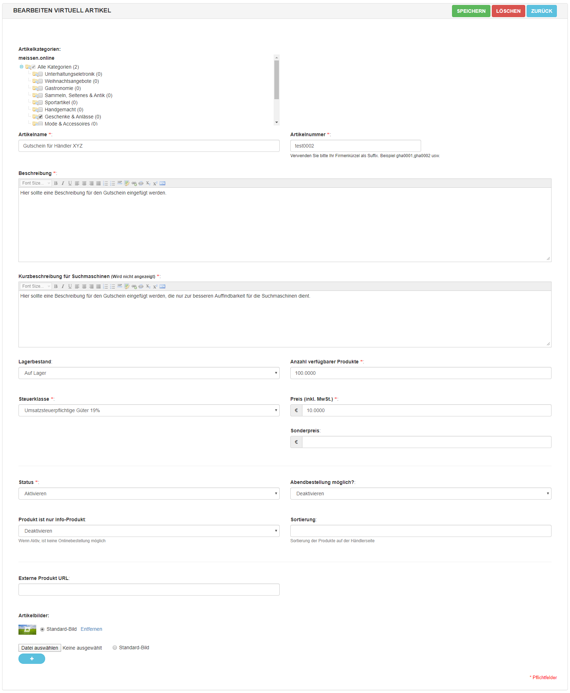

# Gutschein anlegen

Bevor Sie einen Gutschein anlegen können, ist es notwendig ein Händlerkonto zu erstellen. Wie das funktioniert 
 und wie Sie Ihre Händlerinformationen bearbeiten können, erfahren Sie auf folgender Seite: 
 [Händlerkonto erstellen und bearbeiten](https://docs.pdir.de/#/kundendoku/meissen.online/haendlerkonto-verwalten).

Um einen Gutschein anzulegen, klicken Sie in der linken Navigationsleiste auf **Neuer Artikel** und wählen den 
Artikeltyp **Virtueller Artikel** aus. Bei einem virtuellen Artikel werden keine Versandkosten berechnet.

Anschließend erscheint die Eingabemaske für das Anlegen des Gutscheins. Hinweis: Den Speichern-Button finden Sie oben 
rechts.

* **Artikelkategorien:** Bitte wählen Sie die entsprechenden Kategorien aus.
* **Artikelname:** Bitte vergeben Sie einen Namen für den Gutschein.
* **Artikelnummer:** Bitte vergeben Sie Ihr Firmenkürzel als Suffix: z. B. gha0001, gha0002 usw.
* **Beschreibung:** Geben Sie hier eine Beschreibung des Gutscheins an.
* **Kurzbeschreibung für Suchmaschinen:** Vergeben Sie hier eine Beschreibung, die nur zur besseren Auffindbarkeit für 
Suchmaschinen wie Google dient (maximal 320 Zeichen).
* **Gewicht:** Das Gewicht wird derzeit noch nicht auf der Webseite angezeigt, daher können Sie hier auch 0 eintragen.
* **Lagerbestand:** Wählen Sie Auf Lager aus, wenn der Artikel aktuell bestellt werden kann.
* **Anzahl verfügbarer Produkt:** Geben Sie hier die Anzahl der aktuell verfügbaren Artikel an, bei jeder Bestellung wird 
die Lagermenge aktualisiert.
* **Steuerklasse:** Wählen Sie die entsprechende Steuerklasse aus.
* **Preis (inkl. MwSt.):** Geben Sie den Artikelpreis an (mit Komma oder Punkt getrennt und ohne Währungszeichen).
* **Sonderpreis:** Wenn Sie dieses Feld ausfüllen, wird dieser Preis, statt dem regulären Preis, angezeigt.
* **Status:** Wählen Sie Aktivieren aus, wenn der Artikel auf der Webseite angezeigt werden soll.
* **Abendbestellung möglich:** Eine Abendbestellung ist derzeit noch nicht möglich, daher können Sie dieses Feld ignorieren.
* **Produkt ist nur Info-Produkt:** Deaktivieren Sie diese Option, damit der Artikel bestellt werden kann.
* **Sortierung:** Hier können Sie eine Zahl zur Sortierung Ihrer Produkte eintragen. Die Produkte werden dann aufsteigend 
danach sortiert.
* **Artikelbilder:** Fügen Sie neue Bilder hinzu, indem Sie auf Datei auswählen klicken. Ein Bild muss immer als 
Standard-Bild definiert werden. Weitere Bilder können Sie dann über den blauen Plus-Button hinzufügen.

Nachdem der Gutschein angelegt wurde, erscheint dieser auf Ihrer Händlerseite und unter dem Menüpunkt 
[Produkte](https://meissen.online/alle-produkte.html) und kann nun online von Ihren Kunden bestellt werden. Als 
Zahlungsart ist derzeit nur Vorkasse möglich, der Kunde erhält Ihre Kontodaten in seiner Bestellbestätigungsmail. In 
den Einstellungen in Ihrem Händler-Dashboard können Sie Ihre 
[Zahlungsinformationen bearbeiten](kundendoku/meissen.online/haendlerkonto-verwalten.md?id=zahlungsinformationen-hinterlegen). 

Nach Zahlung können Sie Ihren Gutschein dann individuell auf einem Versandweg Ihrer Wahl verschicken (per Post oder 
E-Mail oder später durch Abholung). Bei jeder neuen Bestellung bekommen Sie als Händler ebenfalls eine 
Bestellbestätigungsmail und können alle Ihre Bestellungen im Händler-Dashboard unter 
[Bestellungen](kundendoku/meissen.online/bestellungen-verwalten.md) einsehen.

