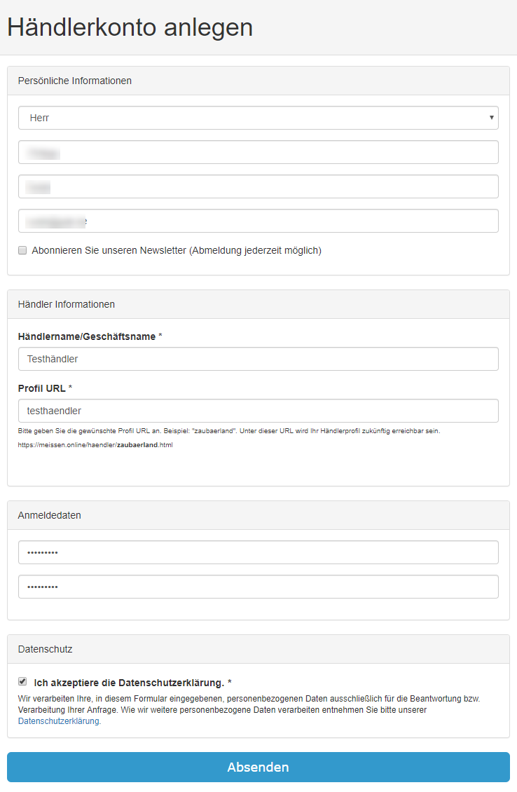
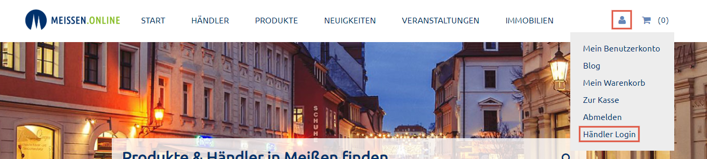
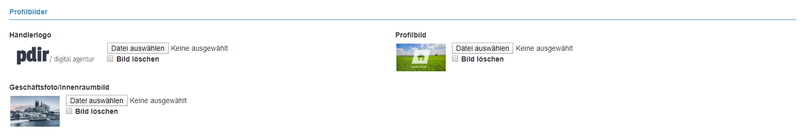
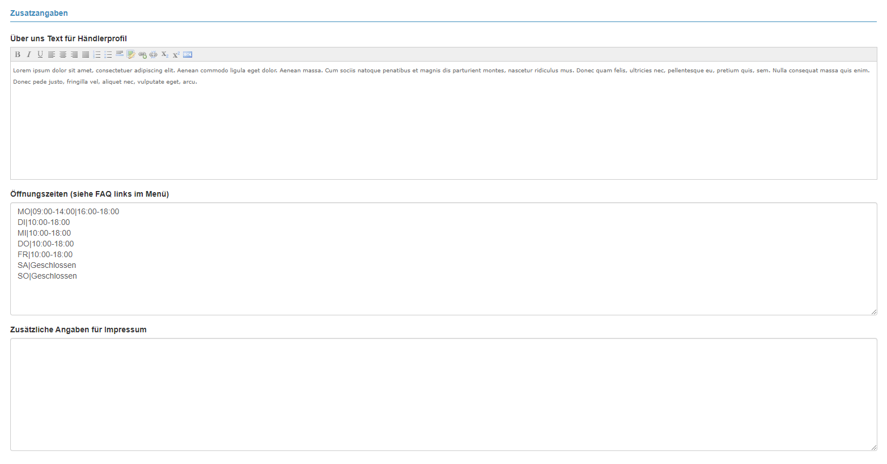
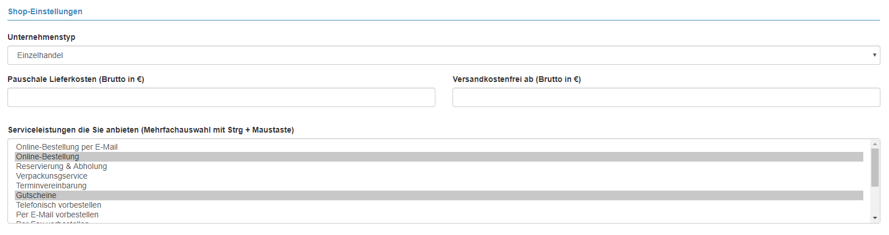
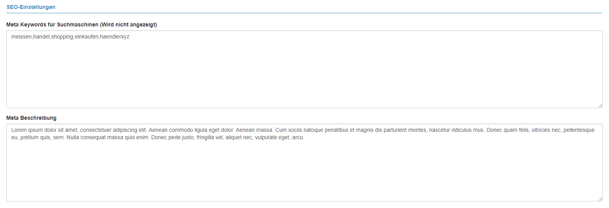
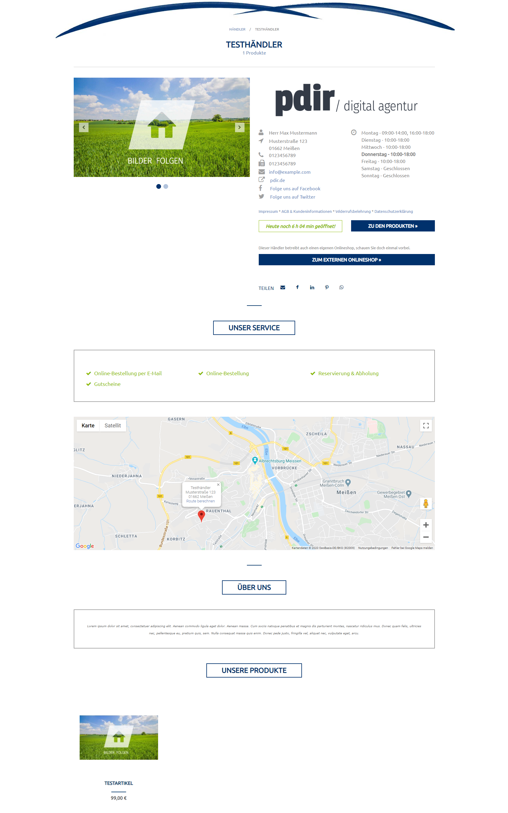
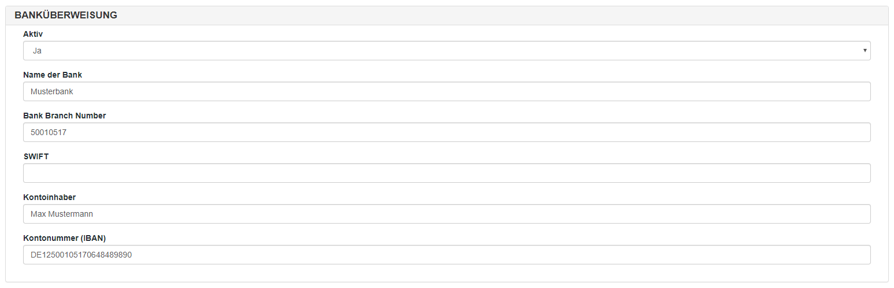

# Händlerkonto verwalten

- [Ein Händlerkonto anlegen](kundendoku/meissen.online/haendlerkonto-verwalten.md?id=ein-händlerkonto-anlegen)
- [Im Händler-Dashboard anmelden](kundendoku/meissen.online/haendlerkonto-verwalten.md?id=im-händler-dashboard-anmelden)
- [Händlerinformationen bearbeiten](kundendoku/meissen.online/haendlerkonto-verwalten.md?id=händlerinformationen-bearbeiten)
- [Zahlungsinformationen hinterlegen](kundendoku/meissen.online/haendlerkonto-verwalten.md?id=zahlungsinformationen-hinterlegen)

## Ein Händlerkonto anlegen

Rufen Sie folgende URL auf, um ein Händlerkonto anzulegen: https://meissen.online/control/account/create/

Füllen Sie nun das Registrierungsformular aus:
* **Persönliche Informationen** (Anrede, Vor- und Nachname, E-Mail)
* Händlerinformationen
  * **Händlername**: Name, der in der Händlerübersicht und auf der Händlerdetailseite angezeigt wird
  * **Profil URL**: Unter dieser URL wird ihr Händlerprofil zukünftig erreichbar sein. Geben Sie z. B. haendlerxyz ein, 
  wird ihr Profil unter folgender URL erreichbar sein: https://meissen.online/haendler/haendlerxyz.html. Vermeiden Sie 
  Leerzeichen, Sonderzeichen, Umlaute oder Großbuchstaben.
* **Anmeldedaten** und **Datenschutzerklärung akzeptieren**



Wenn Sie auf Absenden geklickt haben, sollten Sie zum Händler Dashboard weitergeleitet werden, wo Sie u. a. Ihre 
Händlerinformationen, Artikel und Bestellungen verwalten können. Ihr Händlerprofil wird dann bereits auf der 
[Händlerübersicht](https://meissen.online/uebersicht-haendler/) auf meissen.online dargestellt.


## Im Händler-Dashboard anmelden

Zum Händler-Dashboard gelangen Sie, indem Sie [meissen.online](https://meissen.online) aufrufen, in der Navigation auf 
der rechten Seite auf das **User-Icon** klicken und **Händler-Login** auswählen.



## Händlerinformationen bearbeiten

Klicken Sie in der linken Navigationsleiste auf **Händler Profil** und anschließend auf den Button **Bearbeiten** 
(oben rechts).

Hinweis: Den Speichern-Button finden Sie oben rechts.

### Profilbilder

Unter Profilbilder sollten Sie jeweils ein **Händlerlogo**, **Profilbild** sowie **Geschäftsfoto/Innenraumbild** 
festlegen. Das Profilbild wird in der Händlerübersicht und auf der Händlerdetailseite dargestellt. Das Händlerlogo und 
das Geschäftsfoto wird nur auf der Händlerdetailseite angezeigt.



### Profilangaben

Unter Profilangaben können Sie Adress- und Kontaktdaten und Links zur Webseite oder sozialen Netzwerken angeben.

Die Links zur Webseite und zum Shop müssen immer mit **http://** oder **https://** beginnen, ansonsten funktioniert die 
Verlinkung nicht richtig.

Bei den Links zum Facebook- und Twitter-Profil tragen Sie nur den Teil **hinter** facebook.com/ bzw. twitter.com/ ein.

Für die Kartendarstellung ist es notwendig die **Latitude** und **Longitude** anzugeben. Diese Angaben können Sie z. B. über 
folgende Webseite herausfinden, indem Sie dort ihre Adresse eingeben: [latlong.net](https://www.latlong.net/).


### Zusatzangaben

Unter Zusatzangaben können Sie einen **Über Uns Text** sowie die **Öffnungszeiten** und zusätzliche Angaben für das 
Impressum angeben, die auf der Händlerdetailseite angezeigt werden.

Die Öffnungszeiten (unter Zusatzangaben) müssen in einem speziellen Format angegeben werden, damit im Händlerprofil 
angezeigt werden kann wie lange der Händler heute noch geöffnet hat. z. B. wie folgend:

```
MO|09:00-14:00|16:00-18:00
DI|10:00-18:00
MI|10:00-18:00
DO|10:00-18:00
FR|10:00-18:00
SA|Geschlossen
SO|Geschlossen
```



### Shop-Einstellungen

Wählen Sie einen **Unternehmenstyp** aus (Einzelhandel, Gastronomie oder Dienstleister). Desweiteren können Sie hier noch 
auswählen welche **Serviceleistungen** Sie anbieten, diese werden in der Händlerdetailansicht dargestellt.

Derzeit können leider bei **Pauschale Lieferkosten** und **Versandkostenfrei ab** noch keine eigenen Beträge eingetragen werden.



### SEO-Einstellungen

Unter SEO-Einstellungen können Sie **Keywörter** und eine **Beschreibung** eingeben, damit Sie von Suchmaschinen besser 
gefunden werden. Diese werden auf der Webseite nicht sichtbar angezeigt. In der Regel reicht es eine Beschreibung 
anzugeben, da die Keywörter von den meisten Suchmaschinen (inkl. Google) nicht mehr ausgewertet werden.



### Beispiel eines Händlerprofils

So könnte ein Händlerprofil bei meissen.online am Ende aussehen:



## Zahlungsinformationen hinterlegen

Zur Zeit ist nur Vorkasse als Zahlungsart möglich. Ihre Zahlungsinformationen können Sie hinterlegen, indem Sie in der 
linken Navigationsleiste auf **Einstellungen** und **Transaction Settings** klicken.

Unter Banküberweisung können Sie Ihre Kontodaten hinterlegen (Bank Branch Number = BIC). Der Kunde erhält die 
Zahlungsinformationen mit der Bestätigungsmail.


