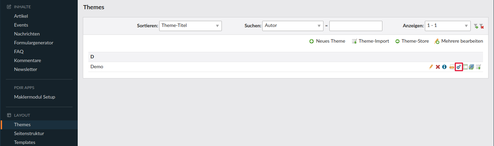
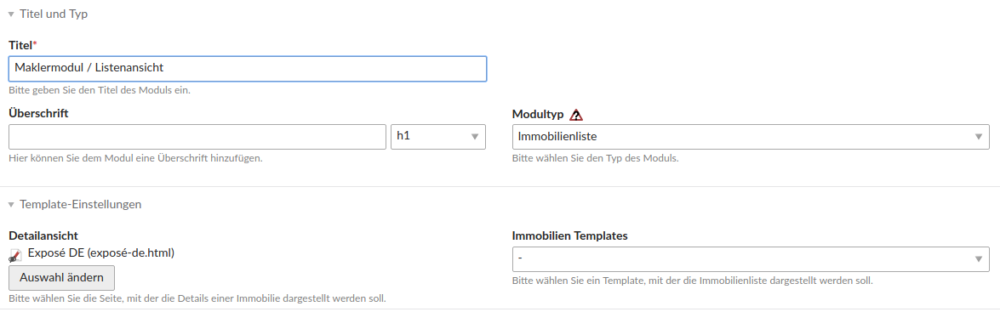
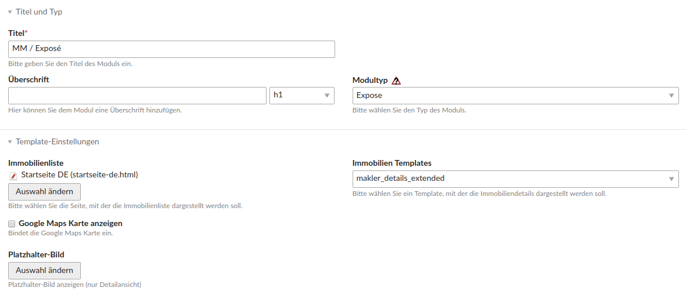
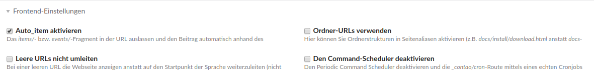

# Einrichtung

Legen Sie als erstes jeweils eine Seite für die Listenansicht und Detailansicht an.

### Module anlegen

In der linken Navigation wählen Sie unter **Layout** den Menüpunkt **Themes** aus und wählen für das Theme Ihrer Webseite das Zahnrad-Icon **Die Frontend-Module des Themes ID … bearbeiten** aus.

#### Modul für die Listenansicht anlegen

Wählen Sie **Neues Modul** aus und legen ein Modul für die Listenansicht an:

* Vergeben Sie einen **Titel** für Ihre Immobilienliste.
* Wählen Sie bei **Modultyp** unter pdirMaklermodul **Immobilienliste** aus.
* Wählen Sie bei **Detailansicht** die entsprechende Seite aus.
* Wenn kein Template ausgewählt wird, wird standardmäßig das Template **makler\_list** genutzt

Wie Sie Felder und Filter in der Listenansicht anzeigen können, finden Sie auf der Seite [Dargestellte Felder und Filter](/konfiguration.md). Weitere Einstellungsmöglichkeiten finden Sie auf der Seite [Konfiguration der Listenansicht](/sortiermoglichkeiten.md).

#### Modul für die Detailansicht \(Exposé\) anlegen

Wählen Sie **Neues Modul** aus und legen ein Modul für die Detailansicht an:

* Vergeben Sie einen **Titel** für das Exposé.
* Wählen Sie bei **Modultyp** unter pdirMaklermodul **Expose** aus.
* Wählen Sie bei **Immobilienliste** die Seite aus, mit der die Immobilienliste dargestellt werden soll.
* Wählen Sie bei Immobilien-Templates entweder das Template **makler\_details\_simple**_ oder _**makler\_details\_extended** aus.

**Optional:**

* Sie können eine **Google Maps Karte** darstellen. Genaueres erfahren Sie auf der Seite [Google Maps integrieren](/google_maps_integrieren.md).
* Sie können ein eigenes **Platzhalterbild** setzen, falls beim Immobilienobjekt kein Bild hinterlegt ist. Wird kein Platzhalterbild ausgewählt und das Immobilienobjekt besitzt kein Bild, wird ein moduleigenes Platzhalterbild dargestellt.

### Module einbinden

Wenn Sie die Module angelegt haben, müssen Sie sie noch die Module in den Artikeln der Listen- und Detailansicht einbinden.

* Den entsprechenden Artikel der Listen- oder Detailansicht auswählen.
* **Neues Element** wählen und an einer beliebigen Stelle platzieren.
* **Elementtyp** **Modul** auswählen und das angelegte Modul auswählen.

### Einstellungen

* Damit die Verlinkung zur Detailseite funktioniert, muss in den **Einstellungen** unter Frontend-Einstellungen **Auto\_item aktivieren** ausgewählt sein.

