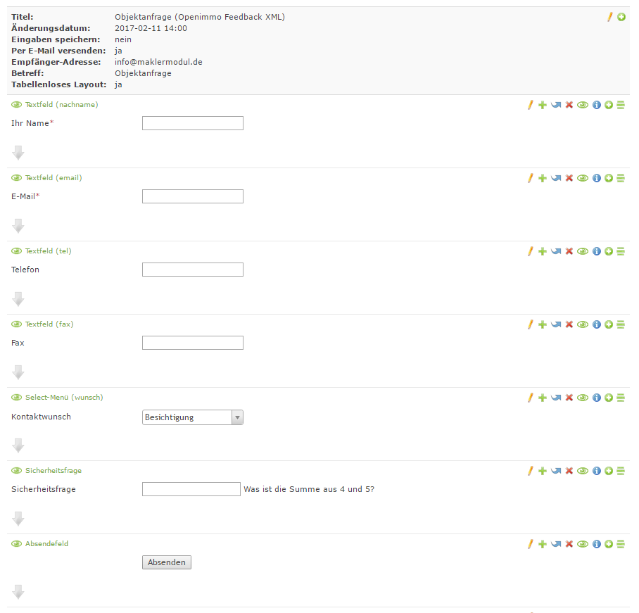
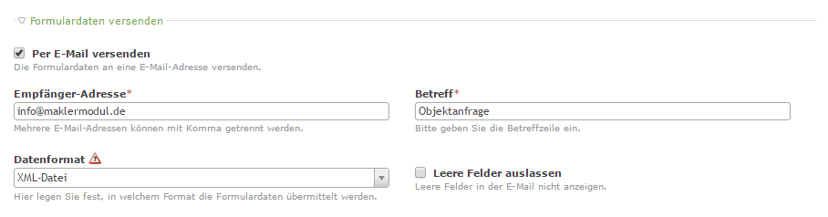
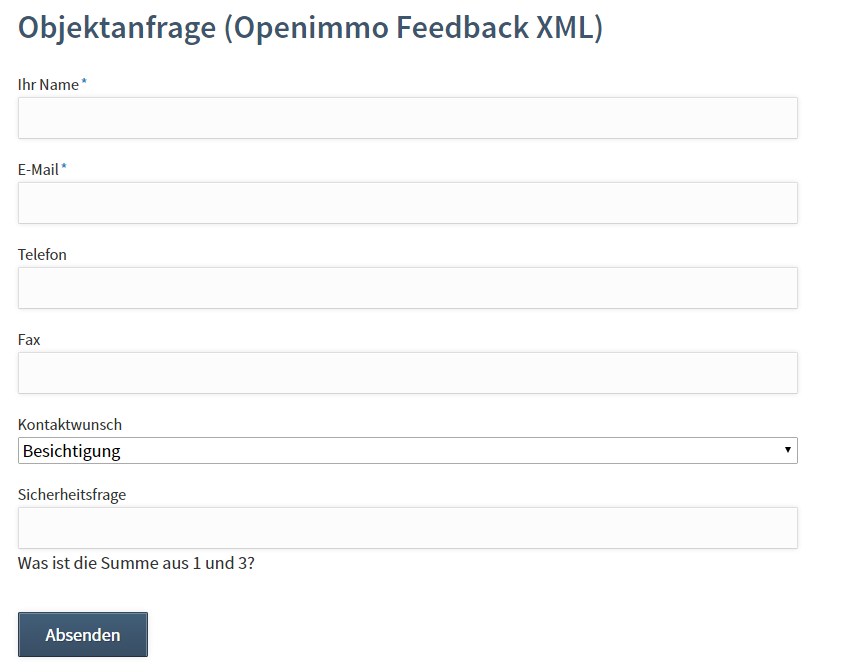

# Formular mit Openimmo Feedback XML

Legen Sie über den Formulargenerator ein neues Formular an mit dem Namen "Objektanfrage" an. Fügen Sie die gewünschten Felder und Beschreibungen hinzu. Verwenden Sie als Feldnamen die Felder \(&lt;interessent&gt;\) aus dem Beispiel der Openimmo XML am Ende dieses Artikels. Die Daten für &lt;sender&gt; und &lt;objekt&gt; werden automatisch befüllt.




Wählen Sie in den Einstelungen des Formulares als Datenformat "XML-Datei" aus.



Platzieren Sie das Modul nun auf der Detailseite Ihrer Immobilienseite. Das Modul ersetzt das Original "form\__xml" _Template mit dem Template "form\__openimmo_\_feedback\_xml".

## So kann das fertige Formular aussehen



## Aufbau des Openimmo Feedback XML

```
<?xml version="1.0" encoding="UTF-8"?>
<openimmo_feedback>
    <version>1.2.5</version>
    <sender>
        <name>name</name>
        <openimmo_anid>openimmo_anid</openimmo_anid>
        <datum>datum</datum>
        <makler_id>makler_id</makler_id>
        <regi_id>regi_id</regi_id>
    </sender>
    <objekt>
        <portal_unique_id>portal_unique_id</portal_unique_id>
        <portal_obj_id>portal_obj_id</portal_obj_id>
        <anbieter_id>anbieter_id</anbieter_id>
        <oobj_id>oobj_id</oobj_id> <!-- PFLICHTFELD -->
        <zusatz_refnr>zusatz_refnr</zusatz_refnr>
        <expose_url>expose_url</expose_url>
        <vermarktungsart>vermarktungsart</vermarktungsart>
        <bezeichnung>bezeichnung</bezeichnung>
        <etage>etage</etage>
        <whg_nr>whg_nr</whg_nr>
        <strasse>strasse</strasse>
        <ort>ort</ort>
        <preis>preis</preis>
        <gebot>gebot</gebot>
        <wae>wae</wae>
        <interessent>
            <int_id>int_id</int_id>
            <anrede>anrede</anrede>
            <vorname>vorname</vorname>
            <nachname>nachname</nachname>
            <firma>firma</firma>
            <strasse>strasse</strasse>
            <postfach>postfach</postfach>
            <plz>plz</plz>
            <ort>ort</ort>
            <tel>tel</tel>
            <fax>fax</fax>
            <mobil>mobil</mobil>
            <email>email</email>
            <bevorzugt>EMAIL</bevorzugt>
            <wunsch>BESICHTIGUNG</wunsch>
            <anfrage>anfrage</anfrage>
        </interessent>
    </objekt>
</openimmo_feedback>
```

### Auszug aus der Openimmo Feedback XML Definition V1.25

```
...
<xsd:element name="bevorzugt" minOccurs="0" maxOccurs="unbounded"><!--V123 optional-->
	<xsd:annotation>
		<xsd:documentation>Bevorzugte Kontaktart des Kunden. Attribut kann mehrfach vorkommen</xsd:documentation>
	</xsd:annotation>
	<xsd:simpleType>
		<xsd:restriction base="xsd:string">
			<xsd:enumeration value="EMAIL"/>
			<xsd:enumeration value="TEL"/>
			<xsd:enumeration value="MOBIL"/>
			<xsd:enumeration value="FAX"/>
			<xsd:enumeration value="BRIEF"/>
		</xsd:restriction>
	</xsd:simpleType>
</xsd:element>
<xsd:element name="wunsch" minOccurs="0" maxOccurs="unbounded"><!--V123 optional-->
	<xsd:annotation>
		<xsd:documentation>Der Info-/Aktivitätenwunsch des Kunden. Attribut kann mehrfach vorkommen</xsd:documentation>
	</xsd:annotation>
	<xsd:simpleType>
		<xsd:restriction base="xsd:string">
			<xsd:enumeration value="BESICHTIGUNG"/>
			<xsd:enumeration value="ANRUF"/>
			<xsd:enumeration value="DETAIL"/>
		</xsd:restriction>
	</xsd:simpleType>
</xsd:element>
<xsd:element name="anfrage" type="xsd:string" minOccurs="0"/><!--V123 optional-->
<xsd:element ref="user_defined_extend" minOccurs="0" maxOccurs="unbounded"/>
...
```


