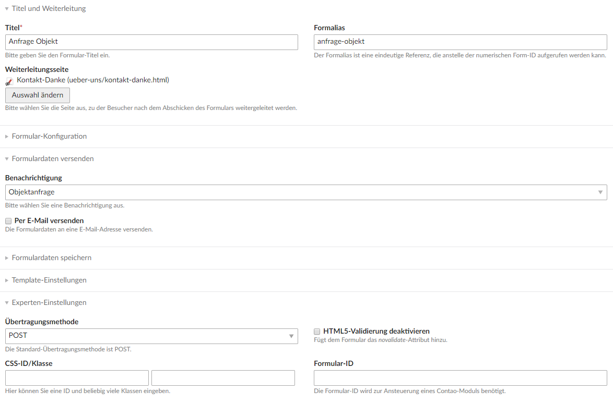
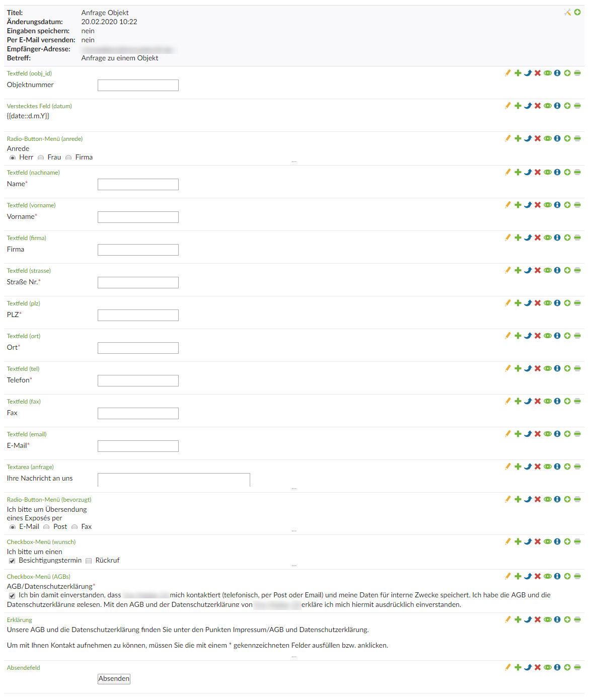
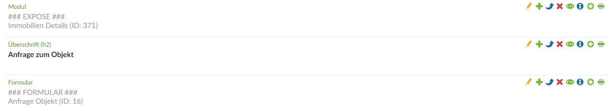
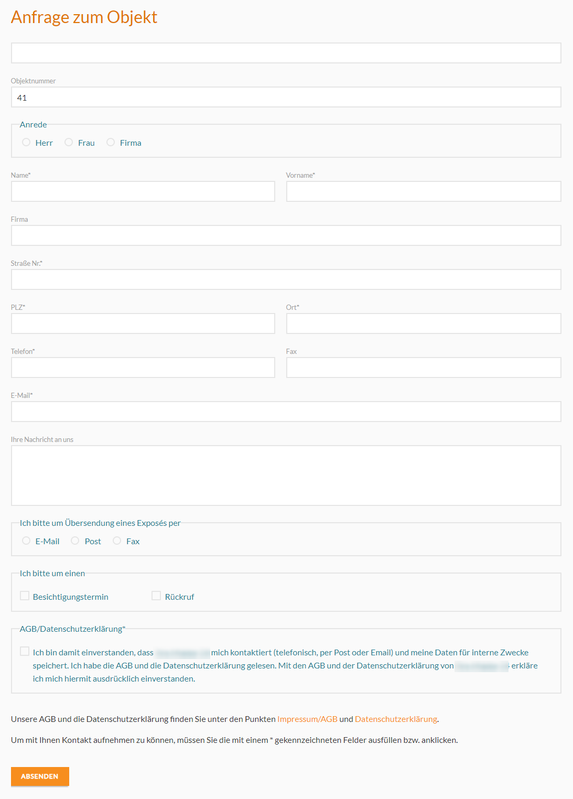
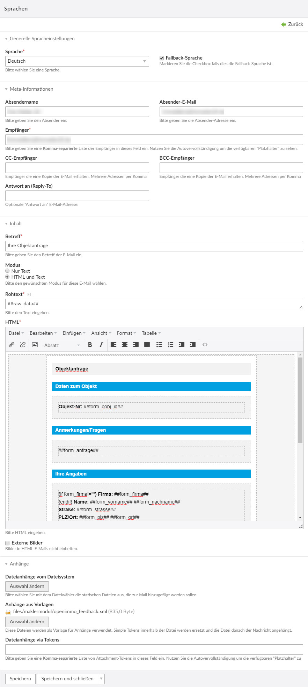

# Formular mit Openimmo Feedback XML

In dieser Anleitung geht es darum, wie man in Contao 4 mit dem Maklermodul und dem Notification Center ein 
Objektanfrage-Formular mit Openimmo Feedback XML einrichten kann. Ziel ist, dass die Objektanfragen in der 
Immobiliensoftware nicht einfach nur im Posteingang, sondern unter "Objektanfragen" angezeigt werden.

In den folgenden Schritten gehen wir davon aus, dass neben dem Maklermodul das 
[Notification Center](https://extensions.contao.org/?q=notification%20center&pages=1&p=terminal42%2Fnotification_center) 
installiert und die Immobilienliste sowie das Exposé eingerichtet ist.

## Objektanfrage-Formular anlegen

Um das Objektanfrage-Formular einzurichten, legen wir unter Formulargenerator ein neues **Formular** an und nennen dieses 
z. B. "Anfrage Objekt". Zudem sollte man noch eine **Weiterleitungsseite** auswählen, zu welcher der Besucher nach dem 
Absenden des Formulars weitergeleitet werden soll. Die **Benachrichtigung** müssen wir später anlegen, daher lassen wir 
dieses Feld vorerst leer.



## Formularfelder anlegen

In dem angelegten Formular müssen nun die Felder erstellt werden.

Für die Objektnummer kann ein normales Textfeld oder ein verstecktes Feld angelegt werden. Der Feldname muss hier 
_oobj_id_ heißen.

Die Feldnamen der anderen Felder müssen genauso wie in dem folgenden Screenshot bzw. wie in dem darauffolgenden 
XML-Beispiel heißen. Es müssen allerdings nicht alle Felder, die in dem XML-Beispiel vorkommen, angelegt werden.



**XML-Beispiel:**  

```
<openimmo_feedback>
	<sender>
		<name/>
		<openimmo_anid/>
		<datum>01.01.2010</datum>
		<makler_id>12345</makler_id>
	</sender>
	<objekt>
		<portal_unique_id/>
		<portal_obj_id/>
		<anbieter_id/>
		<oobj_id>Objektnummer</oobj_id>
		<zusatz_refnr/>
		<expose_url>http:www.domain.de/expose?ID=12345</expose_url>
		<vermarktungsart>Kauf</vermarktungsart>
		<bezeichnung>Kurzbeschreibung</bezeichnung>
		<etage/>
		<whg_nr/>
		<strasse>Objekt_Strasse</strasse>
		<ort>Objekt_Ort</ort>
		<preis>Objektpreis</preis>
		<gebot/>
		<wae/>
		<interessent>
			<int_id/>
			<anrede>Herr</anrede>
			<vorname>Vorname_Interessent</vorname>
			<nachname>Nachname_Interessent</nachname>
			<firma>Firma_Interessent</firma>
			<strasse>Strasse_Interessent</strasse>
			<postfach/>
			<plz>PLZ</plz>
			<ort>Ort_Interessent</ort>
			<tel>01234/1234567</tel>
			<fax>01224/6545223</fax>
			<mobil/>
			<email>email@domain.de</email>
			<bevorzugt>EMAIL, POST oder FAX</bevorzugt>
			<wunsch>BESICHTIGUNG oder RÜCKRUF</wunsch>
			<anfrage>Anfrage-Text </anfrage>
		</interessent>
	</objekt>
</openimmo_feedback>
```

## Formular platzieren und Objektnummer befüllen

Das Formular kann dann im Artikel des Exposé eingefügt werden, indem Sie den Elementtyp **Formular** und das 
entsprechende Formular auswählen.



Damit in dem Formularfeld für die Objektnummer auch wirklich der richtige Wert eingetragen wird, benötigen wir ein 
kleines Stück jQuery-Code. Den folgenden Code können Sie z. B. in einer **eigenen JavaScript-Datei** platzieren oder im 
Layout unter **Eigener JavaScript-Code** hinterlegen.

```
<script>
jQuery(document).ready(function($) {
	if(typeof $('.verwaltung_techn-objektnr_extern') != 'undefined') {
		$('input[name="oobj_id"]').val( $('.verwaltung_techn-objektnr_extern .value-text').html() );
	}
});
</script>
```

So könnte das fertige Objektanfrageformular dann aussehen:



## Openimmo Feedback XML anlegen

Im nächsten Schritt legen wir in der Dateiverwaltung eine Datei mit dem Namen **openimmo_feedback.xml** an. Diese muss 
wie im folgenden Beispiel aussehen.

```
<?xml version="1.0" encoding="ISO-8859-1"?>
<openimmo_feedback>    
	<sender>        
		<name>Ihre Makler 24</name>        
		<datum>16.03.2020</datum>        
		<makler_id>5038545</makler_id>    
	</sender>    
	<objekt>        
		<oobj_id>##form_oobj_id##</oobj_id>        
		<interessent>            
			<anrede>##form_anrede##</anrede>            
			<vorname>##form_vorname##</vorname>            
			<nachname>##form_nachname##</nachname>            
			<strasse>##form_strasse##</strasse>            
			<plz>##form_plz##</plz>            
			<ort>##form_ort##</ort>            
			<tel>##form_tel##</tel>            
			<fax>##form_fax##</fax>            
			<email>##form_email##</email>            
			<bevorzugt>##form_bevorzugt##</bevorzugt>            
			<wunsch>##form_wunsch##</wunsch>            
			<anfrage>##form_anfrage##</anfrage>        
		</interessent>    
	</objekt>
</openimmo_feedback>
```

## Benachrichtigung anlegen

**Benachrichtigung anlegen:**

Damit das Formular auch verschickt wird, legen wir unter _Notification Center - Benachrichtigungen_ eine neue 
Benachrichtigung an und wählen beim Benachrichtigungstyp _Formularübertragung_ aus.

**Nachricht anlegen:**

Anschließend legen wir eine neue Nachricht an und wählen den Gateway aus. Wenn noch kein Gateway angelegt ist, 
navigiere in der linken Navigation zu Gateways und lege dort eines an. Dort können auch SMTP-Daten eintragen werden, 
wenn das Häkchen _SMTP-Einstellungen überschreiben_ aktiviert wird. Nun nicht vergessen, in der Nachricht das Häkchen 
zum Veröffentlichen der Nachricht zu setzen.

**Sprache anlegen:**

Sobald in der Nachricht das Gateway ausgewählt ist, können über den Button _Sprachen verwalten_ neue Sprachen 
hinzugefügt werden. Es öffnet sich nun ein neues Fenster, in welchem über den Button oben rechts eine neue Sprache 
anlegt werden kann.

Dazu sind folgende Schritte nötig (orientiere dich an dem folgenden Screenshot):

* Sprache Deutsch auswählen und Checkbox mit Fallback-Sprache aktivieren
* Metadaten ausfüllen (Absendername, Absender-E-Mail, Empfänger)
* Inhalte ausfüllen
  * Betreff der E-Mail eingeben
  * Modul HTML und Text auswählen
  * bei Rohtext z. B. ##raw_data## eintragen
  * HTML ausfüllen (Beispiel am Ende des Beitrages)
* Unter Anhänge - Anhänge aus Vorlagen die eben angelegte openimmo_feedback.xml auswählen



Folgender HTML-Code könnte z. B. beim Feld HTML einfügt werden. Dazu klicken wir einfach auf das Icon **<>** , um den 
Quelltexteditor zu öffnen und den HTML-Code einzufügen.

```
<!-- BODY -->
<table class="body-wrap" style="font-family: 'Helvetica Neue', 'Helvetica', Helvetica, Arial, sans-serif; width: 100%; background: #f5f5f5;">
<tbody>
	<tr>
		<td class="container" style="margin: 0 auto!important; display: block!important; max-width: 600px;" align="" bgcolor="#FFFFFF">
			<h1 style="margin: 20px 15px; padding: 10px; line-height: 1.1; margin-bottom: 15px; color: #000; font-size: 14px; background: #f2f2f2; font-weight: bold;">Objektanfrage</h1>
			<!-- content -->
			<div class="content" style="padding: 5px 15px;">
				<h2 style="margin: 0; padding: 5px 10px; line-height: 1.1; margin-bottom: 15px; color: #fff; font-size: 14px; background: #00a0e1;">Daten zum Objekt</h2>
				<table class="greybox obj-daten" style="margin: 0; padding: 15px; background: #f2f2f2; margin-bottom: 20px; width: 100%;" bgcolor="">
				<tbody>
					<tr style="margin: 0; padding: 0;">
						<td style="margin: 0; padding: 0;">
							<p style="margin: 0; padding: 0; color: #000; margin-bottom: 5px; font-weight: normal; font-size: 14px; line-height: 1.6;"><label style="margin: 0; padding: 0; font-weight: bold; color: #000; display: inline-block;">Objekt-Nr:</label> ##form_oobj_id##</p>
						</td>
					</tr>
				</tbody>
				</table>
				<h2 style="margin: 0; padding: 5px 10px; line-height: 1.1; margin-bottom: 15px; color: #fff; font-size: 14px; background: #00a0e1;">Anmerkungen/Fragen</h2>
				<table class="greybox" style="margin: 0; padding: 15px; background: #f2f2f2; margin-bottom: 20px; width: 100%;" bgcolor="">
				<tbody>
					<tr style="margin: 0; padding: 0;">
						<td style="margin: 0; padding: 0;">
							<p style="margin: 0; padding: 0; color: #000; margin-bottom: 5px; font-weight: normal; font-size: 14px; line-height: 1.6;">##form_anfrage##</p>
					</td>
					</tr>
				</tbody>
				</table>
				<h2 style="margin: 0; padding: 5px 10px; line-height: 1.1; margin-bottom: 15px; color: #fff; font-size: 14px; background: #00a0e1;">Ihre Angaben</h2>
				<table class="greybox" style="margin: 0; padding: 15px; background: #f2f2f2; margin-bottom: 20px; width: 100%;" bgcolor="">
				<tbody>
					<tr style="margin: 0; padding: 0;">
						<td style="margin: 0; padding: 0;">
							<p style="margin: 0; padding: 0; color: #000; margin-bottom: 5px; font-weight: normal; font-size: 14px; line-height: 1.6;">
							{if form_firma!=""} <strong>Firma:</strong> ##form_firma##<br>{endif}
							<strong>Name:</strong> ##form_vorname## ##form_nachname##<br>
							<strong>Straße:</strong> ##form_strasse##<br>
							<strong>PLZ/Ort:</strong>##form_plz## ##form_ort##<br>
							<strong>E-Mail:</strong> ##form_email##<br>
							<strong>Tel:</strong> ##form_tel##<br>
							{if form_fax!=""}<strong>Fax:</strong> ##form_fax##<br>{endif}
							{if form_wunsch!=""}Ich bitte um einen {if form_wunsch=="BESICHTIGUNG"}Besichtigungstermin{endif}{if form_wunsch=="RÜCKRUF"}Rückruf{endif}<br>{endif}
							{if form_bevorzugt!=""}Ich bitte um Übersendung eines Exposés per {if form_bevorzugt=="EMAIL"}E-Mail{endif}{if form_bevorzugt=="POST"}Post{endif}{if form_bevorzugt=="FAX"}Fax{endif}<br>{endif} 
							{if form_AGBs!=""}Ich bin damit einverstanden, dass XXX mich kontaktiert (telefonisch, per Post oder Email) und meine Daten für interne Zwecke speichert. Ich habe die AGB und die Datenschutzerklärung gelesen. Mit den AGB und der Datenschutzerklärung von XXX erkläre ich mich hiermit ausdrücklich einverstanden.{endif}
							</p>
						</td>
					</tr>
				</tbody>
				</table>
			</div>
			<!-- /content -->
		</td>
	</tr>
</tbody>
</table>
<!-- /BODY -->
```

Wenn alles entsprechend dieser Anleitung angelegt wurde, sollte das Openimmo Feed XML Formular nun funktionieren. :)