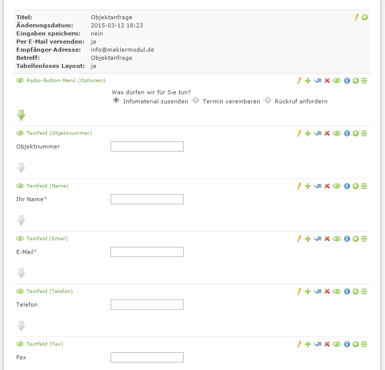
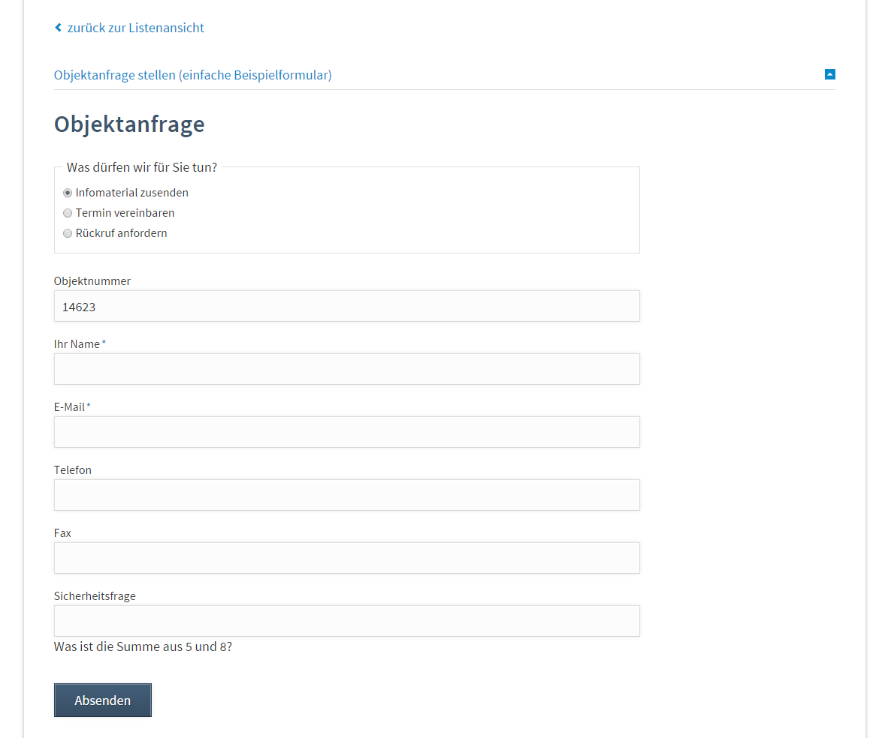

# Einfaches Formular für Objektanfrage einbinden

Legen Sie über den Formulargenerator ein neues Formular an mit dem Namen "Objektanfrage" an. Fügen Sie die gewünschten Felder und Beschreibungen hinzu, vergessen Sie nicht ein Feld für die Objektnummer, gern auch als Verstecktes Feld, anzulegen.



## Objektnummer übernehmen

Mit ein wenig Javascript können wir die Objektnummer an das erstellte Input-Feld übergeben.

**Übergabe der Objektnummer an das Input-Feld mit der ID "ctrl\_17" mit jQuery\*\***

```
if(typeof jQuery('.verwaltung_techn-objektnr_extern') != 'undefined')
    jQuery('#ctrl_17').val(jQuery('.verwaltung_techn-objektnr_extern .value-text').html());
```

**Übergabe der Objektnummer an das Input-Feld mit der ID "ctrl\_17" mit mooTools\*\***

```
if(typeof $('.verwaltung_techn-objektnr_extern') != 'undefined')
    $('#ctrl_17').set('value', $('.verwaltung_techn-objektnr_extern .value-text')[0].get('text'));
```

## So kann das fertige Formular aussehen



