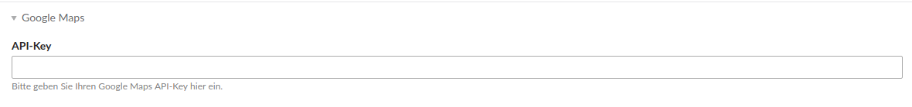
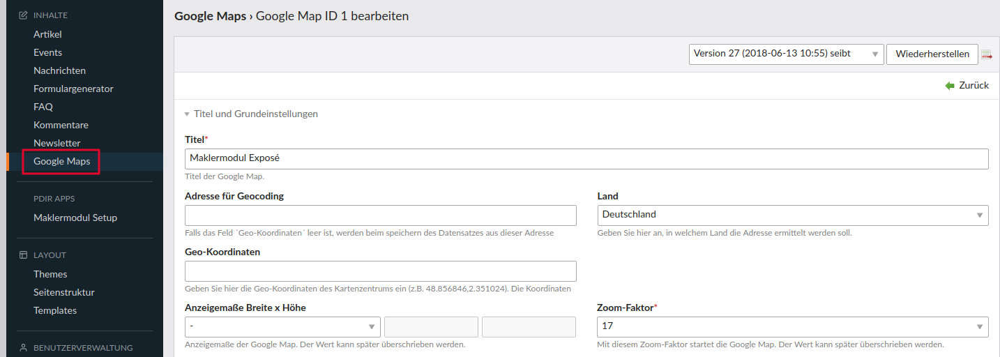
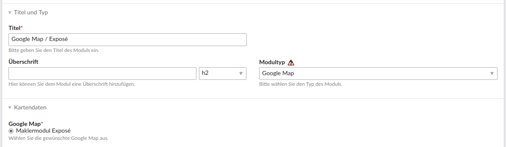
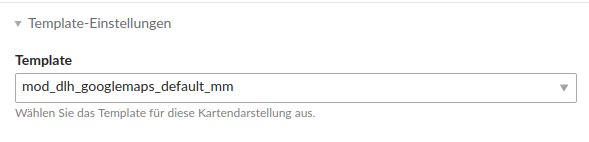
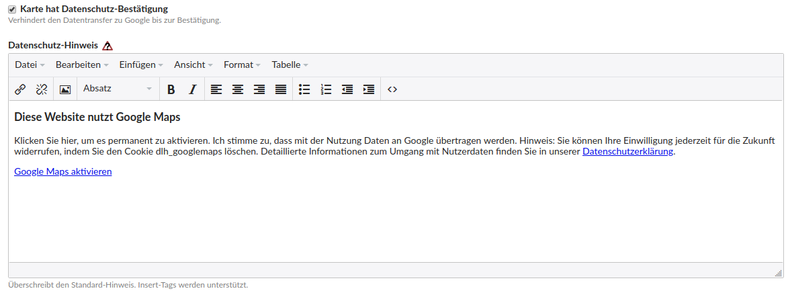
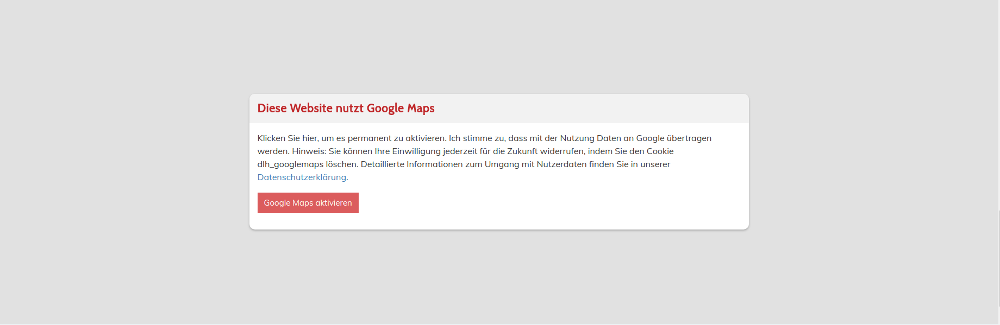

# Google Maps integrieren

Befolgen Sie folgende Schritte um eine Google Maps Karte auf Ihrer Webseite anzuzeigen.

Es ist zudem auch möglich eine datenschutzkonforme Google Maps Karte darzustellen. Der Nutzer sieht erst einen Hinweis, dass Google Maps verwendet wird und muss durch Klicken bestätigen, dass die Karte angezeigt werden darf. So wird der Datentransfer zu Google verhindert, wenn der Nutzer dem nicht einwilligt.

### 1. Google-Maps-Erweiterung installieren:

Um die Erweiterung zu installieren, befolgen Sie die folgenden Schritte:

* Contao-Manager aufrufen und anmelden
* **Pakete installieren** auswählen
* im Suchfeld "dlh\_googlemaps" eingeben
* bei der Erweiterung **delahaye/dlh\_googlemaps** auf **Paket hinzufügen** klicken und **Änderungen anwenden**
* Install-Tool aufrufen und Datenbank aktualisieren


### 2. API-Key in der Seitenstruktur eintragen

In der Seitenstruktur müssen Sie im Startpunkt Ihrer Webseite den Google-Maps-API-Key eintragen. Die Einstellung finden Sie unter dem Reiter Google Maps. Alle notwendigen Informationen zur Erstellung des API-Keys finden Sie auf der [Google Maps APIs Webseite](https://developers.google.com/maps/documentation/javascript/get-api-key?hl=de).



### 3. Google Maps Karte anlegen:

Nach erfolgreicher Installation sollten Sie im linken Menü unter Inhalte einen neuen **Menüpunkt Google Maps** sehen. Klicken Sie darauf und erstellen Sie über den Button **"Neue Google Map"** eine neue Karte. Sie müssen lediglich einen Titel vergeben, alle anderen Einstellungen können Sie so lassen oder nach Ihren Wünschen ändern. Adresse und Geo-Koordinaten werden automatisch vom Maklermodul gesetzt.



### 4. Modul anlegen:

Anschließend klicken Sie im linken Menü unter Layout auf den Menüpunkt **Themes**. Wählen Sie das **Zahnrad-Icon** aus, um die Frontend-Module des Themes zu bearbeiten. Legen Sie nun ein **neues Modul** an.

Vergeben Sie einen aussagekräftigen Titel für Ihr Modul. Als **Modultyp** wählen Sie **Google Map** aus. Dabei können Sie im Select-Feld auch die Suche benutzen. Unter dem Reiter Kartendaten müssen Sie noch Ihre eben angelegte Karte auswählen.



Unter dem Reiter Template-Einstellungen wählen Sie das Template **mod\_dlh\_googlemaps\_default\_mm**_ aus._



#### Datenschutz-Hinweis:

Über eine Checkbox können Sie den Datenschutz-Hinweis aktivieren oder deaktivieren, damit Daten an Google erst gesendet werden, wenn der Nutzer explizit einwilligt. Wenn Sie das Feld für den Datenschutz-Hinweis leer lassen, wird der Standard-Text des Moduls eingefügt. Alternativ können Sie auch einen eigenen Text einfügen oder unser folgendes Beispiel übernehmen.



Wenn Sie im Quelltext \(über das Icon &lt;&gt;\) folgenden Code einfügen, wird der Datenschutzhinweis wie im folgenden Bild auf Ihrer Webseite dargestellt.

```
<h3>Diese Website nutzt Google Maps</h3>
<p>Klicken Sie hier, um es permanent zu aktivieren. Ich stimme zu, dass mit der Nutzung Daten an Google übertragen werden. Hinweis: Sie können Ihre Einwilligung jederzeit für die Zukunft widerrufen, indem Sie den Cookie dlh_googlemaps löschen. Detaillierte Informationen zum Umgang mit Nutzerdaten finden Sie in unserer Datenschutzerklärung.</p>
<p><a class="btn" href="#">Google Maps aktivieren</a></p>
```



### 5. Anpassung des Maklermodul-Templates

Wählen Sie im linken Menü unter Layout den Menüpunkt Templates aus und bearbeiten Sie Ihr Detailansicht-Template \(makler\_details\_extended oder makler\_details\_simple\). Wenn das Template noch nicht in diesem Ordner liegt, müssen Sie über den Button "Neues Template" ein Neues erstellen.

Im Template fügen Sie, an der Stelle wo die Karte dargestellt werden soll, folgenden Code-Schnipsel ein. Die ID müssen Sie durch die ID des angelegten Moduls ersetzen \(diese sehen Sie ganz oben, wenn Sie das Modul bearbeiten\).

```
{{insert_module::ID}}
```

Wenn die Karte nur dann dargestellt werden soll, wenn die Adresse auch wirklich freigegeben ist, fügen Sie den Code-Schnipsel in die folgende if-Abfrage ein.

#### **Beispiel für die Einbindung der Google-Maps-Karte:**

```php
<?php if($this->estate->renderer('verwaltung_objekt.objektadresse_freigeben')->asText()->value(true) == true && $this->showMap == 1): ?>
    <h3>Karte</h3>
    <div class="address">
        <h4>Objektanschrift</h4>
        <?php $this->estate->renderer('geo.strasse')->asText()->value() ?> <?php $this->estate->renderer('geo.hausnummer')->asText()->value() ?><br />
        <?php $this->estate->renderer('geo.plz')->asText()->value() ?> <?php $this->estate->renderer('geo.ort')->asText()->value() ?>
    </div>

    {{insert_module::48}}

    <script>
        $(document).ready( function() {
            $("#confirm-googlemaps").click( function() {
                setMap();
            });

            $("#confirm-googlemaps .btn").click( function() {
                $("#confirm-googlemaps").trigger("click");
                return false;
            });

            var mapsCookie = "<?= \Input::cookie('dlh_googlemaps') ?>";
            if(mapsCookie != "" || $(".dlh_googlemap > div").attr("id") != "confirm-googlemaps") {
                setMap();
            }

            function setMap() {
                setTimeout( function() {
                    var geocoder = new google.maps.Geocoder();
                    var lat; var lng;
                    geocodeAddress(geocoder);
                },500);
            }

            function geocodeAddress(geocoder, resultsMap) {
                var address = "<?php $this->estate->renderer('geo.strasse')->asText()->value() ?>";
                address = address + " <?php $this->estate->renderer('geo.hausnummer')->asText()->value() ?>";
                address = address + ", <?php $this->estate->renderer('geo.ort')->asText()->value() ?>";
                geocoder.geocode({'address': address}, function(results, status) {
                    if (status === google.maps.GeocoderStatus.OK) {
                        lat = results[0].geometry.location.lat();
                        lng = results[0].geometry.location.lng();
                        setCenter(lat, lng);
                        setMarker(lat, lng);
                    }
                });
            }

            function setCenter(lat, lng) {
                gmap1.setCenter(new google.maps.LatLng(lat, lng));
            }

            function setMarker(lat, lng) {
                var gmap1_marker = new google.maps.Marker({
                    position: new google.maps.LatLng(lat, lng),
                    map: gmap1,
                    zIndex: 1
                });
            }
        });
    </script>
<?php endif; ?>
```

### Optional: CSS-Anpassungen

Um CSS-Anpassungen vorzunehmen, bearbeiten Sie Ihre CSS-Datei. Wenn Sie noch keine angelegt haben, legen Sie eine CSS-Datei an, z. B. style.css, und wählen diese im Seiten-Layout unter Externe Stylesheets aus.

#### Code-Schnipsel

Nachfolgend sind einige Code-Schnipsel aufgelistet, die zeigen wie Sie Farben, Breiten und Höhen anpassen können.

**Höhe der Google Maps Karte ändern:**

```
.mod_dlh_googlemaps, .dlh_googlemap {
    height: 600px;
}
```

**Datenschutz-Hinweis ändern:**

```
#confirm-googlemaps {
    background: #fff;
    color: #000;
    width: 50%;
}
```

**h3-Überschrift ändern:**

```
#confirm-googlemaps h3 {
    background: #f2f2f2;
    color: #b91e1e;
}
```

**Button ändern:**

```
#confirm-googlemaps a.btn {
    background: #d45a5a;
    color: #fff;
}
```

**Button-Hover ändern:**

```
#confirm-googlemaps a.btn:hover {
    background: #b91e1e;
    color: #fff;
}
```


