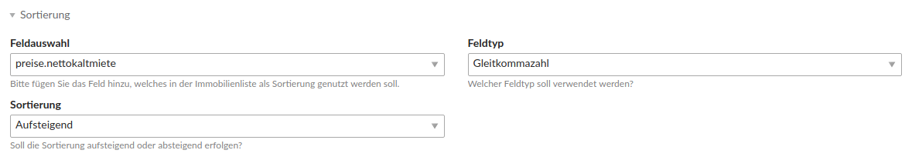
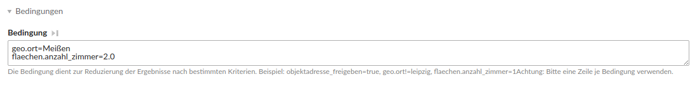
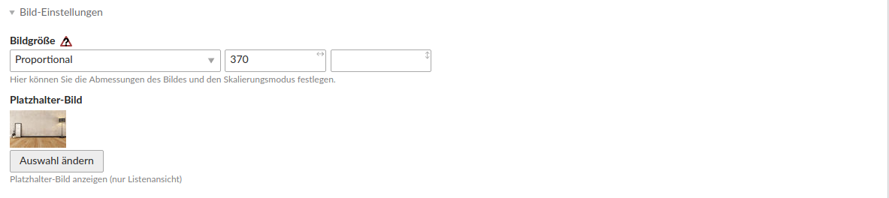
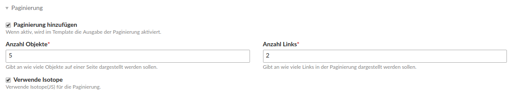
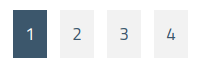
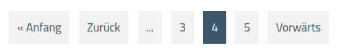
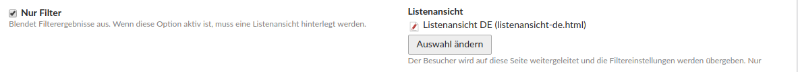
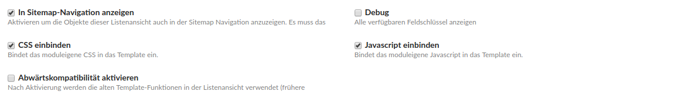

# Konfiguration der Listenansicht

### Sortierung

Sie haben die Möglichkeit Ihre Immobilien in der Listenansicht Ihrer Homepage nach einen bestimmten Feld zu sortieren.

Bei **Feldauswahl** können Sie auswählen, nach welchem Feld sortiert werden soll.

Bei **Feldtyp** wählen Sie den Feldtyp \(Zahl, Gleitkommazahl oder Text\) aus.

Bei **Sortierung** wählen Sie aus ob sie aufsteigend oder absteigend sortieren lassen wollen.

### Bedingungen



Das Feld **Bedingungen** dient zur Reduzierung der Ergebnisse nach bestimmten Kriterien. Wollen Sie z. B. alle Zweizimmerwohnungen aus dem Ort Meißen anzeigen, fügen Sie die zwei Zeilen aus dem Bild ein. Fügen Sie nur eine Bedingung pro Zeile ein.

**Weitere Beispiele:**

Ort UNGLEICH Leipzig

```
geo.ort!=Leipzig
```

Objektadresse freigegeben

```
objektadresse_freigegeben=true
```

### Bildeinstellungen

Wählen Sie bei Bildgröße den gewünschten Bildmodus aus. Sie haben folgende Einstellmöglichkeiten:

* **Proportional: **Die längere Seite des Bildes wird an die Rahmenbox angepasst.
* **An Rahmen anpassen:** Die kürzere Seite des Bildes wird an die Rahmenbox angepasst.
* **Wichtiger Teil:** Festlegen eines wichtigen Bereiches, der als Bildausschnitt genutzt wird.
* **Links \| Oben:** Bildausschnitt links oben.
* **Mitte \| Oben:** Bildausschnitt mittig oben.
* **Rechts \| Oben: **Bildausschnitt rechts oben.
* **Links \| Mitte:** Bildausschnitt links mittig.
* **Mitte \| Mitte:** Bildausschnitt mitte mittig.
* **Rechts \| Mitte:** Bildausschnitt rechts mittig.
* **Links \| Unten:** Bildausschnitt links unten.
* **Mitte \| Unten: **Bildausschnitt mittig unten.
* **Rechts \| Unten:** Bildausschnitt rechts unten.

Im ersten Textfeld neben der Auswahl des Bildmodus geben Sie die **Breite** in Pixeln ein. Im folgenden Textfeld geben Sie die **Höhe** in Pixeln ein.

Außerdem kann ein eigenes **Platzhalter-Bild** gesetzt werden, falls beim Immobilienobjekt in der Listenansicht kein Bild hinterlegt ist. Wird kein Platzhalter-Bild ausgewählt und das Immobilienobjekt besitzt kein Bild, wird ein moduleigenes Platzhalter-Bild dargestellt.

### Paginierung



Bei **Anzahl der Objekte** können Sie auswählen, wie viele Objekte auf einer Seite angezeigt werden sollen.

Bei **Anzahl der Links** können Sie auswählen wie viele Links in der Pagination angezeigt werden sollen. Dafür müssen Sie die Option **Verwende Isotope** aktivieren.

Beispiel - Verwende Isotope aktiviert:



Beispiel - Verwende Isotope nicht aktiviert:



### Nur Filter



Wenn Sie bei Optionen **Nur Filter **aktivieren, werden alle Filtergebnisse ausgeblendet. Sie müssen allerdings eine Listenansicht angeben, zu der weitergeleitet wird, wenn man auf den Button Immobilien suchen klickt. Die Filtereinstellungen werden dann übernommen.

### Weitere Optionen



Bei **In Sitemap-Navigation anzeigen** werden die Objekte dieser Listenansicht auch in der Sitemap Navigation angezeigt. Es muss das Template _nav\_makler\_sitemap_ in den Templateeinstellungen der Sitemap-Navigation ausgewählt werden.

**Debug** zeigt alle verfügbaren Feldschlüssel an, die verwendet werden können.

**CSS einbinden** bindet das moduleigene CSS in das Template ein.

**Javascript einbinden** bindet das moduleigene Javascript ind as Template ein.

**Abwärtskompatibilität** aktivieren bedeutet, dass nach Aktivierung die alten Template-Funktionen in der Listenansicht verwendet werden \(frühere Versionen &lt;1.4.0\). Der Index muss nach einer Änderung neu aufgebaut werden.

