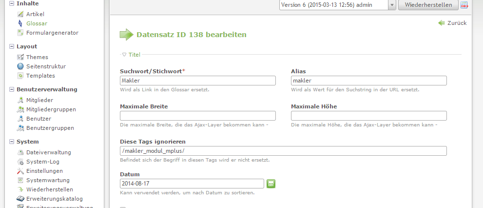

# SWGlossar

Bei der Verwendung der Erweiterung SWGlossar von Sascha Weidner (Sioweb) kann es zu Problemen bei der Ausgabe der Listenansicht kommen.

Die Erweiterung verwendet den Hock "outputFrontendTemplate" um Begriffe im Template zu ersetzen. Dabei kann es vorkommen das Pfade in den Javascripten des Makler Modul fehlerhaft ausgegeben werden.

Ein Beispiel hierfür ist der Begriff "Makler".
SWGlossar ersetzt hierbei auch den Alias "makler" in URLs bzw. Pfadangaben.

Verwenden Sie die Funktion "Diese Tags ignorieren" der Erweiterung um bestimmte Pfadangaben von der Manipulation auszuschließen.

SWGlossar bestimmte Tags ignorieren

