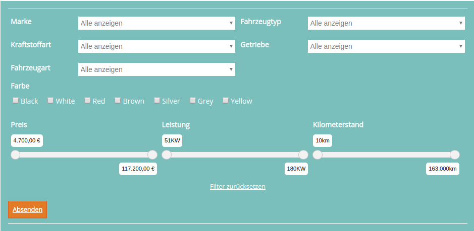

# Module anlegen

* 
Legen Sie zuerst jeweils eine **Seite** für die **Listen- und Detailansicht** an.

## Detailansicht

* 
Für die Detailansicht platzieren Sie ein Element in dem vorgesehenen Artikel und wählen als Elementtyp **Mobile.de Detailansicht** aus.

* Für das Testen der Demo muss in den Feldern *Mobile.de API Benutzer*, *Mobile.de Passwort* und  *Mobile.de Kundennummer* **demo** eingetragen sein.

## Listenansicht

* 
Für die Listenansicht platzieren Sie ein Element in dem vorgesehenen Artikel und wählen als Elementtyp **Mobile.de Listenansicht** aus.

* Zusätzlich müssen Sie in dem Feld **Detailansicht** die Seite mit der Detailansicht auswählen
* In den drei Feldern, wie bei der Detailansicht beschrieben, muss zum Testen der Demo **demo** eingetragen sein.

## Filterformular auf einer eigenen Seite

Ab der Version **2.3.0** des mobile.de Bundle gibt es die Möglichkeit das Filterformular und die Ergebnisse jeweils auf einer eigenen Seite ausgeben zu lassen. 

**Hinweis:** Wenn Sie bereits Template-Anpassungen für die Listenansicht vorgenommen haben, kann es sein, dass noch ein paar Template-Anpassungen notwendig sind. In dem Fall müssten Sie das Original-Template mit Ihrem angepassten Template vergleichen und die entsprechenden Anpassungen vornehmen.

#### Platzieren des Moduls

Um das Filterformular auf einer extra Seite anzeigen zu lassen, platzieren Sie ein Element vom Typ **Mobile.de Listenansicht** und wählen bei Listenansicht die **Seite zur Listenansicht** aus und aktivieren die Option **Nur Filter**.

Am Ende müsste es so aussehen:

Wenn Sie nun auf Absenden klicken, landen Sie direkt auf der gefilterten Ergebnis-Seite.