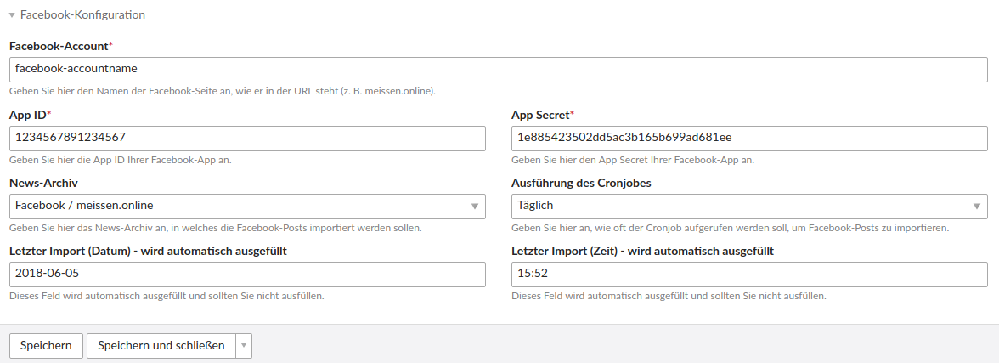

# Einrichtung des Facebook-Streams

## Facebook-App anlegen

Wenn Sie noch keine eigene Facebook App haben, müssen Sie diese erst anlegen. Ohne App können Sie keinen Social Feed Stream auf Ihrer Webseite anzeigen. Wie Sie eine App registrieren und konfigurieren, können Sie auf folgender Seite nachlesen: [https://developers.facebook.com/docs/apps/register?locale=de\_DE](https://developers.facebook.com/docs/apps/register?locale=de_DE).

Die App muss im Dev-Modus laufen und darf nicht live geschaltet werden.

Wenn Sie Beiträge einer Facebook-Seite, von der Sie nicht Admin sind, anzeigen lassen wollen, müssen Sie die Facebook App erst zum App Review einreichen. Für die eigene Facebook Seite ist dies nicht notwendig.

## News-Archiv anlegen

Bevor Sie einen Account anlegen, sollten Sie ein News-Archiv anlegen, in das die Facebook-Posts importiert werden sollen. Eine Weiterleitungsseite müssen Sie beim News-Archiv angeben, da dies ein Pflichtfeld ist, wobei es für das Social Feed Bundle nicht relevant ist, da es keine News-Detailseite gibt. Idealerweise legen Sie für jeden Facebook-Account ein neues News-Archiv aus, da Sie so im Nachrichtenlisten-Modul später auch einzelne Accounts wieder abwählen können.

## Account anlegen

Um einen Account anzulegen, wählen Sie die Schaltfläche **Neuen Social-Feed Account anlegen** und beim Typ **Facebook** aus. Anschließend öffnet sich eine Seite mit dem Formular, wo Sie alle notwendigen Daten zum Account hinterlegen müssen. Nachdem Sie gespeichert haben, kann es sein, dass es 2-3 Minuten dauert bis alle Beiträge importiert wurden.

**Facebook-Account:** Geben Sie hier den Namen des Facebook-Accounts ein. Den Namen sehen Sie immer in der URL, wenn Sie Ihre Facebook-Seite aufrufen \(z. B. [facebook.com/account-name/](https://www.facebook.com/**meissen.online**/%29%29%29\).

**App ID:** Geben Sie hier die App ID Ihrer Facebook-App ein. Ihre App ID und den App Secret \(oder auch App Geheimcode\) können Sie in Ihrer Facebook-App unter Einstellungen &gt; Allgemeines einsehen.

**App Secret: **Geben Sie hier den App Secret bzw. den App Geheimcode ein.

**Access Token:** Geben Sie hier den Access Token ein. Eine Anleitung, wie Sie den Access Token generieren können, finden Sie [hier](/social-feed/generierung-des-facebook-access-tokens.md).

**News-Archiv:** Wählen Sie hier das News-Archiv aus, in welches die Facebook-Posts importiert werden sollen.

**Ausführung des Cronjobs:** Wählen Sie hier aus, wie oft der Cronjob aufgerufen werden soll, um neue Facebook-Posts zu importieren. Sie haben folgende Einstellmöglichkeiten: kein Cronjob, minütlich, stündlich, täglich, wöchentlich und monatlich.

**Letzter Import:** Die zwei Textfelder für den letzten Import dienen nur zur Information, wann der letzte Import stattfand.

_\(Die eingebenen Daten im Screenshot sind lediglich Beispieldaten\)_

## Modul anlegen

Auf der Seite [Einrichtung](/social-feed/einrichtung.md) finden Sie alle weiteren Hinweise zum Anlegen und Platzieren des Moduls.