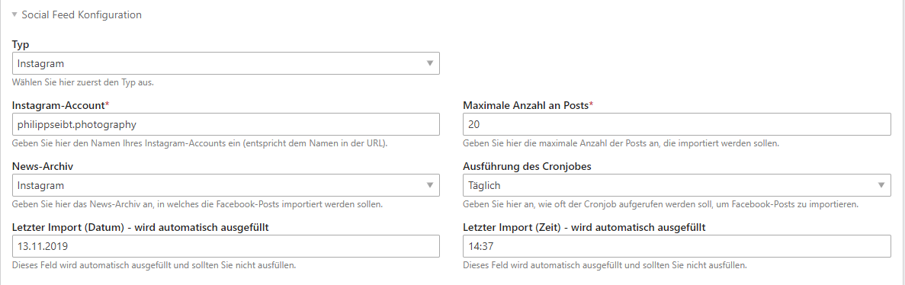

# Einrichtung des Instagram-Streams

## News-Archiv anlegen

Bevor Sie einen Account anlegen, sollten Sie ein News-Archiv anlegen, in das die Instagram-Posts importiert werden sollen. Eine Weiterleitungsseite müssen Sie beim News-Archiv angeben, da dies ein Pflichtfeld ist, wobei es für das Social Feed Bundle nicht relevant ist, da es keine News-Detailseite gibt. Idealerweise legen Sie für jeden Instagram-Account ein neues News-Archiv aus, da Sie so im Nachrichtenlisten-Modul später auch einzelne Accounts wieder abwählen können.

## Account anlegen

Um einen Account anzulegen, wählen Sie die Schaltfläche **Neuen Social-Feed Account anlegen** und beim Typ **Instagram** aus. Anschließend öffnet sich eine Seite mit dem Formular, wo Sie alle notwendigen Daten zum Account hinterlegen müssen. Nachdem Sie gespeichert haben, kann es sein, dass es 2-3 Minuten dauert bis alle Beiträge importiert wurden.

**Instagram-Account:** Geben Sie hier den Namen des Instagram-Accounts ein. Den Namen sehen Sie immer in der URL oder beim Profil selbst.

**Maximale Anzahl an Posts:** Hier können Sie die Anzahl der zu importierenden Posts bestimmen.

**News-Archiv:** Wählen Sie hier das News-Archiv aus, in welches die Facebook-Posts importiert werden sollen.

**Ausführung des Cronjobs:** Wählen Sie hier aus, wie oft der Cronjob aufgerufen werden soll, um neue Facebook-Posts zu importieren. Sie haben folgende Einstellmöglichkeiten: kein Cronjob, minütlich, stündlich, täglich, wöchentlich und monatlich.

**Letzter Import:** Die zwei Textfelder für den letzten Import dienen nur zur Information, wann der letzte Import stattfand.

_\(Die eingebenen Daten im Screenshot sind lediglich Beispieldaten\)_

