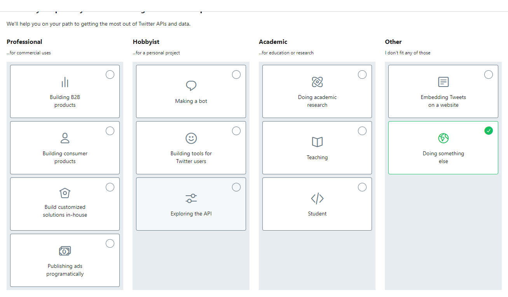
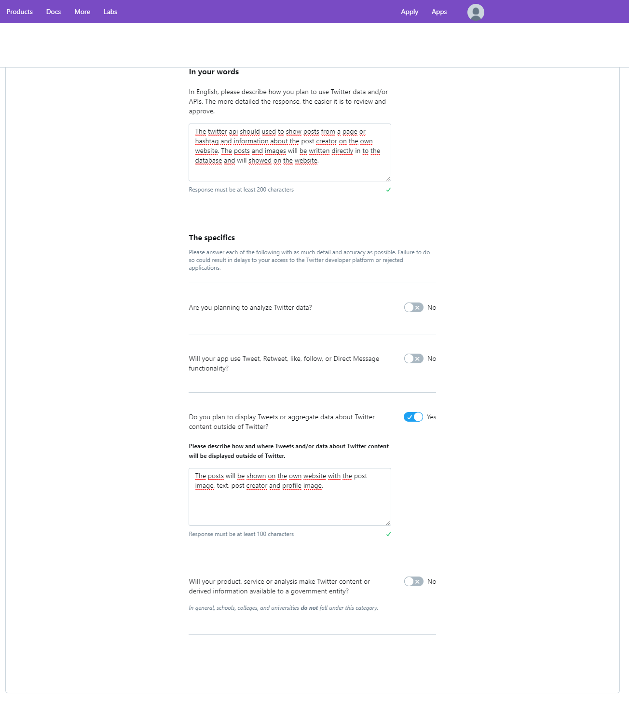
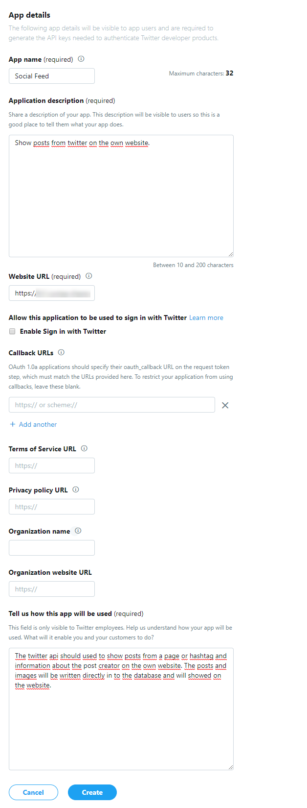
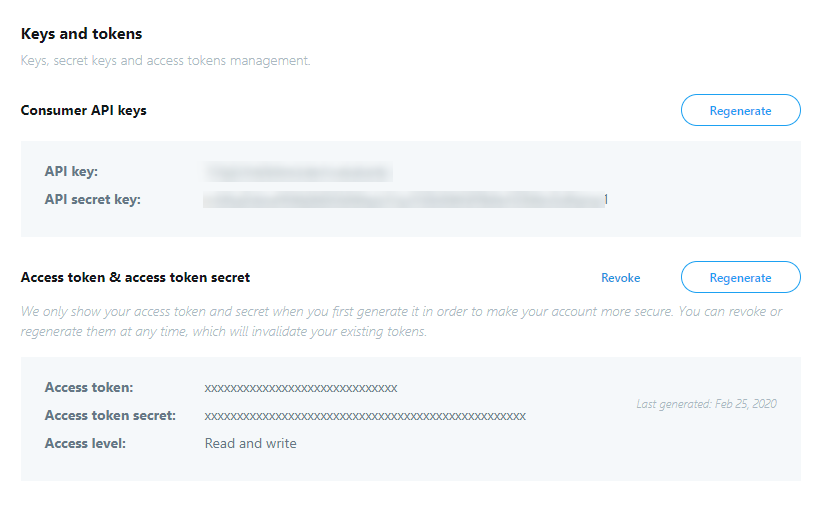

# Einrichtung Twitter-Developer-Account/App

## Developer-Account anlegen

### Schritt 1

Rufen Sie die folgende URL auf https://developer.twitter.com/en/apply-for-access und klicken auf **Apply for a developer 
account**. Melden Sie sich nun mit Ihrem Twitter-Account an bzw. registrieren sich, wenn Sie noch keinen Twitter-Account 
besitzen.

Anschließend öffnet sich eine Seite, wo Sie auswählen müssen warum Sie die Twitter Developer Tools nutzen wollen. 
Wählen Sie **Doing something else** aus.

  

### Schritt 2

Wählen Sie das Land aus und vergeben einen Namen für den Developer-Account.

### Schritt 3

Nun muss beschrieben werden wie die Twitter API genutzt werden soll.

Füllen Sie das erste Eingabefeld z. B. mit diesem vorgeschriebenen Text aus oder beschreiben Sie es mit Ihren eigenen 
Worten (in Englisch).

**_The twitter api will be used to show posts belonging to a page or a hashtag and information about the posts creator 
on the own website. The posts and images will be written directly into the website database and will be showed on the 
website._**

Bei **"Do you plan to display Tweets or aggregate data about Twitter content outside of Twitter?"** könnten Sie den 
folgenden Text eintragen.

**_The posts will be shown on the own website with the post image, text, post creator and profile image._**

Alle anderen Eingabefelder sind nicht relevant, diese können Sie deaktivieren.

  

### Schritt 4

Überprüfen Sie Ihre eingegebenen Daten und klicken anschließend auf **Looks good!**

### Schritt 5

Akzeptieren Sie das **Developer Agreement** und klicken Sie auf **Submit Application**. Anschließend sollten Sie eine 
Bestätigungsemail erhalten. Klicken Sie in dieser auf den Bestätigungslink, um die Registrierung des Developer Accounts 
abzuschließen.

## App anlegen

Auf folgender Seite können Sie eine neue App anlegen: https://developer.twitter.com/en/apps.

Folgende Felder müssen ausgefüllt werden:
* **App name:** Vergeben Sie einen beliebigen Namen für Ihre App (darf noch von keinem anderen Nutzer ausgewählt worden 
sein).
* **Application description:** Tragen Sie hier eine kurze Beschreibung der App ein, z. B. _Show posts from twitter on the 
own website._
* **Website URL:** Tragen Sie hier die URL zu Ihrer Webseite ein.
* **Tell us how this app will be used:** Beschreiben Sie wie die App genutzt werden soll. Sie können hier z. B. den 
Text von oben einfügen.

Wenn die App angelegt worden ist, sollte sich eine neue Seite mit den App Details öffnen. Klicken Sie oben in der 
Navigation auf **Keys and tokens**. Dort können Sie den _API key, API secret key, Access token_ und den _Access token 
secret_ einsehen, die Sie für das Auslesen der Twitter-Posts benötigen. Um den _Access token_ und _Access token secret_ 
zu sehen, müssen Sie beim ersten Mal auf Generate klicken.

