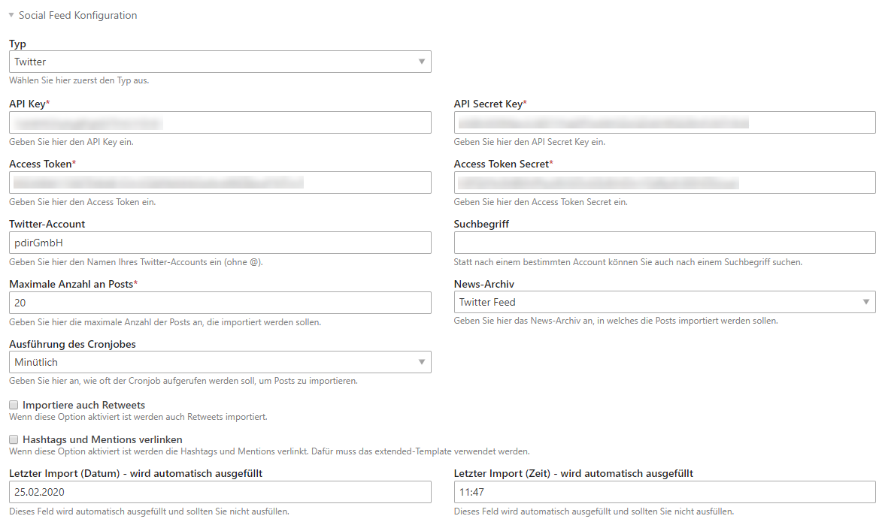

# Einrichtung des Twitter-Streams

## Twitter-Developer-Account und App anlegen

Damit Sie Twitter-Posts auf Ihrer Seite anzeigen können, ist es notwendig einen Twitter-Account sowie einen 
Twitter-Developer-Account anzulegen. Eine Anleitung wie Sie vorgehen müssen finden Sie 
[hier](/social-feed/einrichtung-twitter-app.md).

## News-Archiv anlegen

Bevor Sie einen Account anlegen, sollten Sie ein News-Archiv anlegen, in das die Twitter-Posts importiert werden sollen. 
Eine Weiterleitungsseite müssen Sie beim News-Archiv angeben, da dies ein Pflichtfeld ist, wobei es für das Social Feed 
Bundle nicht relevant ist, da es keine News-Detailseite gibt. Idealerweise legen Sie für jeden Facebook-Account ein 
neues News-Archiv aus, da Sie so im Nachrichtenlisten-Modul später auch einzelne Accounts wieder abwählen können.

## Account anlegen

Um einen Account anzulegen, wählen Sie die Schaltfläche **Neuen Social-Feed Account anlegen** und beim Typ **Twitter** 
aus. Anschließend öffnet sich eine Seite mit dem Formular, wo Sie alle notwendigen Daten zum Account hinterlegen müssen. 
Nachdem Sie gespeichert haben, kann es sein, dass es 2-3 Minuten dauert bis alle Beiträge importiert wurden.

* **API Key:** Zu finden in den App-Details unter dem Tab "Keys and tokens".  
* **Api Secret Key:** Zu finden in den App-Details unter dem Tab "Keys and tokens".  
* **Access Token:** Zu finden in den App-Details unter dem Tab "Keys and tokens".  
* **Access Token Secret:** Zu finden in den App-Details unter dem Tab "Keys and tokens".  
* **Twitter-Account:** Geben Sie hier den Namen des Twitter-Accounts ein, ohne @.
* **Suchbegriff:** Statt die Beiträge eines Accounts anzuzeigen, können Sie auch nach einem bestimmten Suchbegriff suchen.
* **Maximale Anzahl an Posts:** Geben Sie hier die maximale Anzahl an Posts an, die auf einmal importiert werden.
* **News-Archiv:** Wählen Sie hier das News-Archiv aus, in welches die Facebook-Posts importiert werden sollen.
* **Ausführung des Cronjobs:** Wählen Sie hier aus, wie oft der Cronjob aufgerufen werden soll, um neue Facebook-Posts 
zu importieren. Sie haben folgende Einstellmöglichkeiten: kein Cronjob, minütlich, stündlich, täglich, wöchentlich und monatlich.
* **Importiere auch Retweets:** Wenn Sie diese Checkbox aktivieren, werden auch Retweets angezeigt.
* **Hashtags und Mentions verlinken:** Wenn Sie diese Checkbox aktivieren, werden Hashtags (z. B. #contao) und Mentions 
(z. B. @pdirGmbH) verlinkt. Dazu muss im Modul der Nachrichtenliste das Template _news_social_feed_extended_ ausgewählt 
werden.
* **Letzter Import:** Die zwei Textfelder für den letzten Import dienen nur zur Information, wann der letzte Import stattfand.

_\(Die eingebenen Daten im Screenshot sind lediglich Beispieldaten\)_

## Modul anlegen

Auf der Seite [Einrichtung](/social-feed/einrichtung.md) finden Sie alle weiteren Hinweise zum Anlegen und Platzieren des Moduls.