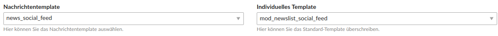
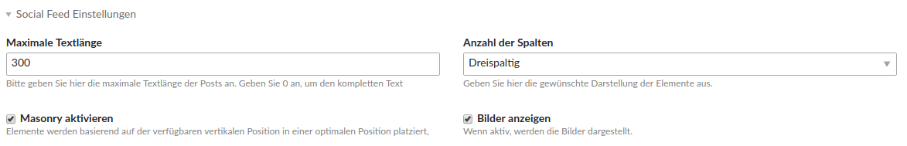

# Einrichtung

## Modul anlegen

Wenn Sie Ihre Accounts angelegt haben, legen Sie nun das dazugehörige Modul an. Dazu navigieren Sie zu **Themes &gt; 
Die Frontend-Module des Theme ID x bearbeiten **\(Zahnrad-Icon\) und legen ein neues Modul an.

Als Modultyp wählen Sie unter Nachrichten die **Nachrichtenliste** aus. Wählen Sie die entsprechenden 
**Nachrichtenarchive** aus, die Sie in Ihrem Social Feed Stream darstellen möchten. Über das Feld **Gesamtzahl der 
Beiträge** können Sie noch die Anzahl der Beiträge begrenzen. Möchten Sie eine Pagination darstellen, füllen Sie das 
Feld **Elemente pro Seite** aus.

Beim Nachrichtentemplate müssen Sie das Template **news\_social\_feed** auswählen. Beim individuellen Template wählen 
Sie **mod\_newslist\_social\_feed** aus. Unter Bildeinstellungen bei **Bildgröße** können Sie die Größe der Bilder 
anpassen.



Unter dem Punkt Social Feed Einstellungen können Sie die **maximale Textlänge**, die **Anzahl der Spalten** einstellen 
sowie **Masonry** aktivieren/deaktivieren und **Bilder anzeigen/ausblenden**.



### Extended Template für Twitter

Damit Hashtags und Mentions verlinkt werden, muss beim Nachrichtentemplate das Template **news_social_feed_extended** 
auswählt werden. Desweiteren muss beim Social Feed Account auch die Checkbox **Hashtags und Mentions verlinken** aktiviert 
sein. 

Eine Demo finden Sie hier: https://demo.pdir.de/social-feed-extended-template.

Bisher funktioniert das nur für Twitter-Posts und noch nicht für Facebook- und Instagram-Posts.

## Modul platzieren

Nachdem Sie das Modul angelegt haben, platzieren Sie das Modul an einer beliebigen Stelle.

## Template-Anpassungen

Wenn Sie Contao 4.4 oder 4.5 nutzen, ist das Beitragsbild noch nicht standardmäßig verlinkt. Wenn Sie das Bild verlinken möchten, müssten Sie das Template **news\_social\_feed.html5** wie folgt anpassen.

```php
<a href="<?= $this->url ?>" target="_blank">
    <?php if ($this->addImage && $this->sfImages): ?>
        <?php $this->insert('image', $this->arrData); ?>
    <?php endif; ?>
</a>
```