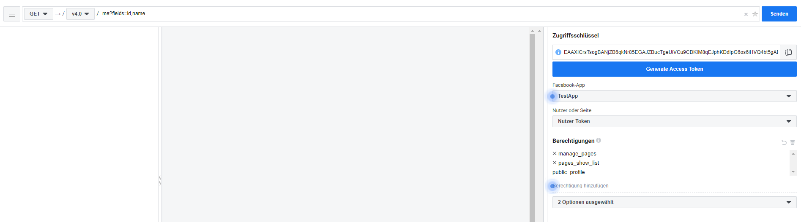
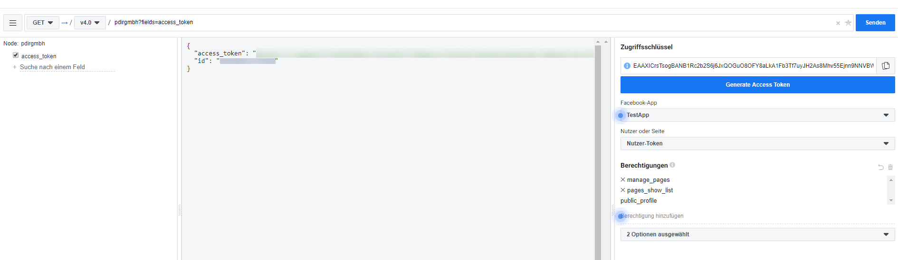
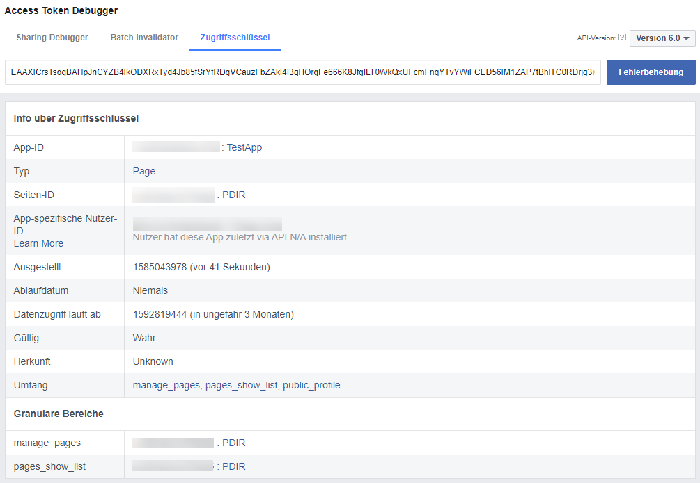

# Facebook Access Token generieren

Um Beiträge der eigenen Facebook-Seite anzuzeigen, müssen Sie im Contao Backend unter Social Feed Accounts den Access Token \(Zugriffsschlüssel\) eingeben. Die folgende Anleitung hilft Ihnen einen Access Token zu generieren, der niemals abläuft.

##### 1. Webseite developers.facebook.com aufrufen

* Rufen Sie die Webseite [https://developers.facebook.com/](https://developers.facebook.com/) auf, klicken Sie in der Navigation auf Anmelden und Loggen sich mit Ihren Facebook Login Daten ein.

##### 2. Access Token generieren

* Rufen Sie nun den Graph API Explorer über folgende URL auf: [https://developers.facebook.com/tools/explorer/](https://developers.facebook.com/tools/explorer/).
* Wählen Sie Ihre angelegte **App** aus.
* Klicken Sie im Auswahlfeld darunter auf **Zugriffsschlüssel des Nutzers anfordern** (Nutzer-Token).
* Als Berechtigungen müssen **manage_pages** und **pages_show_list** ausgewählt werden.
* Klicken Sie auf Generate Access Token und stimmen Sie allen Berechtigungsanfragen zu.

##### 3. Access Token verlängern

* Rufen Sie nun den Access Token Debugger über folgende URL auf: [https://developers.facebook.com/tools/debug/accesstoken](https://developers.facebook.com/tools/debug/accesstoken)
* Fügen Sie den gerade kopierten Zugriffsschlüssel in das Eingabefeld für den Zugriffsschlüssel ein und klicken Sie auf **Fehlerbehebung**.
* Klicken Sie im unteren Bereich der Webseite auf den Button **Zugriffsschlüssel verlängern** und kopieren Sie den generierten Zugriffsschlüssel.

##### 4. Zugriffsschlüssel auslesen, der nie abläuft

* Rufen Sie nun wieder den Graph API Explorer auf: [https://developers.facebook.com/tools/explorer/](https://developers.facebook.com/tools/explorer/).
* Wählen Sie beim Auswahlfeld **App** Ihre angelegte App aus.
* Fügen Sie den kopierten **Zugriffsschlüssel** in das entsprechende Eingabefeld ein.
* Fügen Sie folgendes in das obere Eingabefeld (neben dem Senden-Button) ein: PAGEID?fields=access\_token \(PAGEID ersetzen Sie durch den Namen Ihrer Facebook Seite, wie er in der URL steht. Beispiel: [facebook.com/seiten-name/](/facebook.com/account-name/). PAGEID müssten Sie in diesem Fall durch seiten-name ersetzen.\)
* Wenn Sie jetzt auf **Senden** klicken, müsste eine Ausgabe mit dem Access Token erscheinen. Diesen Access Token, der nie mehr abläuft, müssen Sie im Contao Backend bei Ihrem Social Feed Account eintragen.

**5. Access Token testen \(optional\)**

* Wenn Sie testen wollen, ob der Access Token nie mehr abläuft, rufen Sie wieder den Access Token Debugger auf: [https://developers.facebook.com/tools/debug/accesstoken](https://developers.facebook.com/tools/debug/accesstoken)
* Wenn Sie den Access Token in dem Eingabefeld einfügen und auf Fehlerbehebung klicken, sollte bei Ablaufdatum niemals stehen.
* Hinweis: Wichtig ist nur, dass bei Ablaufdatum Niemals steht.

  

