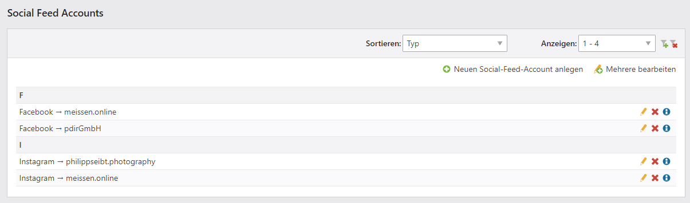

# Installation

Das Modul ist mit Contao 4.3 oder höher kompatibel.

**Folgende Schritte sind für die Installation über den Contao Manager notwendig:**

* Contao Manager aufrufen und anmelden
* **Pakete installieren** auswählen
* im Suchfeld **"Social Feed"** eingeben
* auf **Prüfen & Installieren** klicken und **Änderungen anwenden**
* Install-Tool aufrufen und Datenbank aktualisieren

Nach der Installation des Moduls werden Sie im linken Menü unter **PDIR APPS** den neuen Menüpunkt **Social Feed Accounts** sehen.

Auf dieser Seite können Sie neue Accounts anlegen und deren Einstellungen bearbeiten.

