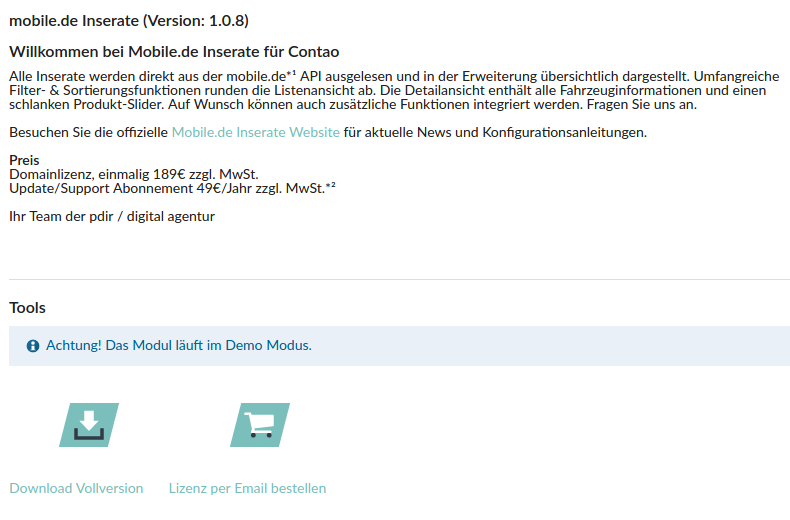

# Einrichtung

## Testen der Demo

* 
Die **Demo** können Sie kostenfrei testen, indem in den Frontend-Modulen der Listen- und Detailansicht in den Feldern *Mobile.de API Benutzer*, *Mobile.de API Passwort* und *Mobile.de API Kundennummer* **demo** eingetragen ist (siehe Abschnitt: Module anlegen).

## Lizenz per E-Mail bestellen

Sobald Daten von mobile.de importiert werden sollen, benötigen Sie eine Lizenz.

* 
Wählen Sie in der linken Navigationsstruktur unter PDIR APPS den Punkt **Mobile.de Setup** aus.
* 
Wählen Sie den Button **Lizenz per E-Mail bestellen** aus. Anschließend öffnet sich Ihr E-Mail-Programm mit einer vorgefertigten E-Mail, wo Sie nur Ihren Domainnamen sowie Ihre Rechnungsanschrift angeben müssen.

## Download der Vollversion

* 
Sobald Ihre Lizenz freigegeben ist, können Sie im **Mobile.de Setup** unter dem Punkt **Download Vollversion** (siehe vorheriger Screenshot) die Vollversion herunterladen.
* 
Anschließend müssen Sie in den Frontend-Modulen der Listen- und Detailansicht in den Feldern *Mobile.de API Benutzer*, *Mobile.de API Passwort* und *Mobile.de API Kundennummer* ihre API-Daten eintragen (in beiden Modulen erforderlich).

