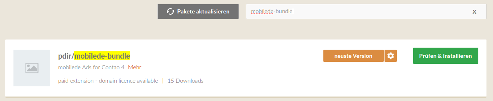

# Installation

## Installation unter Contao 3

* 
in das Backend von Contao einloggen
* 
im Menü Backend-Module unter System den Punkt Erweiterungskatalog wählen
* 
im **Suchfeld** „pdirMobileDe“ eingeben und die Taste **Enter** drücken
* 
im Suchergebnis rechts oben in der Ecke das **Symbol** zum **Installieren** klicken sowie den Anweisungen folgen

ODER

* 
Suchergebnis „pdirMobileDe“ auswählen und Button **Installieren** klicken

## Installation unter Contao 4

### mit Contao Manager

* 
Contao-Manager aufrufen und anmelden
* 
**Pakete installieren** auswählen
* 
im **Suchfeld** "mobilede-bundle" eingeben
* 
auf **Prüfen & Installieren** klicken und **Änderungen anwenden**
* 
Install-Tool aufrufen und Datenbank aktualisieren

