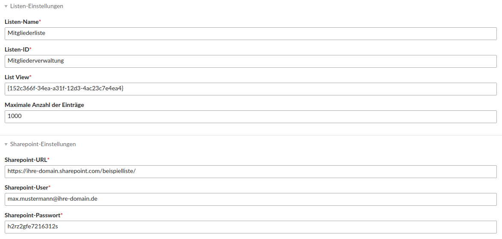

# Einrichtung

## Quelle anlegen
Wählen Sie als erstes in der linken Navigation unter PDIR den Menüpunkt Sharepoint aus. Anschließend legen Sie über den Button "Neue Sharepoint-Liste anlegen" eine neue Sharepoint-Quelle an.

Geben Sie alle Listen- und Sharepoint-Einstellungen ein *(Beispiel: Bild 1)*.


###### Bild 1: Neue Sharepoint-Quelle anlegen (Beispieldaten)


## Modul anlegen

Legen Sie in ihrem Theme ein **neues Modul** mit dem Modultyp **"Sharepoint - DataTables"** an. Wählen Sie im Modul unter **Datenquelle** die eben angelegte Quelle aus und geben unter dem **Hauptknoten** an, unter welchem Knoten die Daten in der Datei liegen.

Sie können auswählen wie viele **Einträge pro Seite** angezeigt werden sollen, welche Werte in der **Select-Box **für die möglichen Einträge pro Seite stehen sollen und ob eine Pagination oder ein Eingabefeld für die Suche dargestellt werden soll.

In der **Tabelle** können Sie über die Plus-Icons neue Zeilen oder Spalten anlegen *(siehe Bild 2)*. Die **erste Reihe** der Tabelle wird immer als Kopfzeile verwendet. In der **zweiten Reihe** legen Sie fest, welche Daten aus der importierten Datei in welcher Spalte dargestellt werden sollen. **Mehrere Einträge in einer Spalte**, können kommagetrennt (ohne Leerzeichen) angegeben werden. In der Tabelle werden diese dann mit einem Leerzeichen getrennt ausgegeben.

Über das Feld **"Sortierung nach Feld"** ist es möglich nach einem Feldnamen (wie er in der 2. Reihe der Tabelle genannt wurde) absteigend oder aufsteigend zu sortieren. Unter **Experteneinstellungen** kann eine ID oder eine Klasse vergeben werden. Eine ID zu vergeben ist aber nicht zwingend notwendig. Wird keine angegeben, generiert das Modul eigenständig eine ID.

#### Individuelle Anpassungen

Individuelle Anpassungen können im Template **mod_datatables.html5** vorgenommen werden. Dazu platzieren Sie das Template einfach in ihrem Template-Ordner. Im Modul können Sie unter Template-Einstellungen ein individuelles Template auswählen.

In der zweiten Reihe der Tabelle können Sie zudem auch Spalten am Anfang oder Ende leerlassen. Diese werden dann bei der Ausgabe der Tabelle ignoriert. So können Sie im Template selbst Spalten hinzufügen.

#### Sprachdatei

Die entsprechende **Sprachdatei** wird anhand der Contao **Website-Einstellung** geladen. Sprachdateien, die nicht geladen werden, können über das Template angegeben werden. Alle Sprachdateien finden Sie auf folgender Seite: [Übersicht der unterstützten Sprachen](https://datatables.net/plug-ins/i18n/). Wenn Sie auf eine Sprache klicken, finden Sie unter CDN die entsprechende Sprachdatei, welche im Template eingebunden werden muss. Dazu ändern Sie im Template im JavaScript-Code die folgende Zeile (in diesem Beispiel für Norwegisch-Bokmal):


```
"language": {
    "url": "//cdn.datatables.net/plug-ins/1.10.16/i18n/Norwegian-Bokmal.json"
},
```

###### Bild 2: Neue Tabelle anlegen (Beispieldaten)
